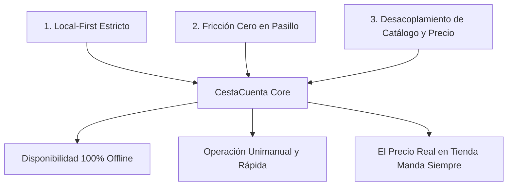

# 01. Visión y Alcance del Producto — CestaCuenta

## 1. Resumen Ejecutivo y Planteamiento del Problema

### 1.1 El Problema en el Punto de Venta
El proceso de compra en supermercados físicos presenta un punto crítico de fricción e incertidumbre para los consumidores: el momento del cobro en caja. Durante el recorrido por los pasillos, los usuarios acumulan artículos sin un control exacto del gasto en curso, enfrentándose a múltiples factores de distorsión:

1. **Discrepancia entre etiqueta y cobro:** Precios desactualizados en lineal, promociones mal señalizadas o condiciones complejas (segunda unidad al 50%, 3x2 condicionado) que generan sorpresas negativas al recibir el ticket.
2. **Ansiedad financiera y pérdida de control:** Familias y personas con presupuestos mensuales estrictos sufren tensión al aproximarse a la cinta de caja, viéndose en ocasiones forzadas a descartar artículos en el último momento.
3. **Complejidad y fricción de las soluciones existentes:** Las aplicaciones de lista de compras tradicionales requieren entrada manual tediosa, carecen de conexión fluida con el precio real en tienda, y las soluciones comerciales de supermercados exigen registro, conectividad constante y exponen al usuario a publicidad y rastreo publicitario masivo.
4. **Condiciones adversas en tienda:** Los interiores de supermercados, hipermercados y plantas subterráneas sufren con frecuencia de baja o nula cobertura móvil, anulando cualquier aplicación dependiente de servicios en la nube.

### 1.2 Declaración de Visión
> **CestaCuenta** es una herramienta de utilidad pura para el comprador físico: una calculadora de cesta de supermercado ultrarrápida, de operativa *local-first*, que permite registrar productos en segundos mediante escaneo de código de barras o teclado numérico, garantizando cálculo financiero exacto en tiempo real, latencia cero y privacidad absoluta sin necesidad de cuentas ni conectividad.

---

## 2. Usuarios Objetivo y Casos de Uso Clave

### 2.1 Segmentos de Usuario

| Segmento | Características y Necesidades | Caso de Uso Principal |
| :--- | :--- | :--- |
| **Comprador de Presupuesto Estricto** | Familias, pensionistas y estudiantes con límite monetario fijo para la cesta semanal o mensual. | Controlar en tiempo real que el total acumulado no supere un umbral prefijado (ej. 50,00 €). |
| **Comprador Analítico y Eficiente** | Usuarios que buscan rapidez, cotejo del ticket en caja y detección inmediata de errores de cobro del establecimiento. | Escanear productos mientras los introduce al carro y contrastar el total estimado frente a la pantalla de la cajera antes de pagar. |
| **Comprador en Áreas de Baja Cobertura** | Clientes habituales de hipermercados o sótanos donde el acceso a datos móviles es nulo o inestable. | Operar al 100% de capacidades de registro, cálculo y consulta en modo avión o sin cobertura. |

### 2.2 Propuesta de Valor

- **Cálculo exacto y determinista:** Aritmética financiera en céntimos enteros que elimina discrepancias por redondeo de coma flotante.
- **Latencia cero (< 100 ms):** Cada interacción (escanear, modificar cantidad, introducir precio) actualiza el total de forma instantánea.
- **Cero fricción de inicio:** Sin pantallas de bienvenida innecesarias, sin registro de usuario, sin selección forzosa de tienda ni descargas de catálogo pesadas.
- **Soberanía del dato:** Toda la información reside en el almacenamiento privado del dispositivo móvil. Cero rastreadores, cero analíticas comerciales.

---

## 3. Objetivos Medibles de Producto (KPIs / Métricas de Éxito)

| Métrica | Objetivo Técnico / Cuantitativo | Justificación |
| :--- | :--- | :--- |
| **Tiempo de adición con escáner** | $\le 1{,}5\text{ s}$ desde enfoque hasta renderizado del total actualizado | Asegura que el escaneo no retrase el ritmo natural de compra en el pasillo. |
| **Tiempo de adición manual** | $\le 4{,}0\text{ s}$ para introducir nombre rápido y precio en teclado dedicado | Mantiene la usabilidad fluida para artículos sin código (fruta, panadería). |
| **Precisión de cálculo financiero** | $0{,}00\%$ de error de cálculo por redondeo binario | Prohibición absoluta de tipos float/double en la lógica de dominio. |
| **Disponibilidad sin conexión** | $100\%$ de las funciones críticas operativas offline | La aplicación debe funcionar de forma autónoma sin red. |
| **Tiempo de arranque en frío (Cold Start)** | $\le 800\text{ ms}$ en dispositivos de gama media | Acceso instantáneo en cuanto el usuario toma el carro de la compra. |
| **Tasa de fotogramas en lista** | $60\text{ fps}$ sostenidos en listas de hasta 200 ítems | Experiencia táctil fluida sin caídas perceptibles de rendimiento. |

---

## 4. Alcance del MVP y Delimitación

### 4.1 Funcionalidades Dentro del Alcance (In Scope)

1. **Gestión de Sesión Activa de Compra:**
   - Creación automática de sesión al iniciar la aplicación si no existe una activa.
   - Lista interactiva de artículos con actualización en tiempo real de subtotales y total acumulado.
   - Modificación inmediata de cantidades mediante selectores rápidos (`+` / `-`).
   - Edición in situ de precios y nombres de artículos.
   - Eliminación individual de líneas y vaciado completo de la cesta con confirmación de seguridad.
   - Persistencia continua del estado: si la aplicación se cierra forzosamente o el sistema la mata por memoria, el estado se recupera íntegro al volver a abrirla.

2. **Captura de Artículos:**
   - Escáner de códigos de barras 1D mediante cámara trasera (EAN-13, EAN-8, UPC-A, UPC-E).
   - Control de linterna/antorcha integrado en la interfaz de escaneo para pasillos con iluminación deficiente.
   - Mecanismo de debounce y prevención de dobles lecturas accidentales.
   - Entrada manual mediante teclado numérico especializado optimizado para importes monetarios.
   - Soporte para artículos a granel y productos de peso variable.

3. **Lógica Económica y Descuentos:**
   - Descuentos directos en céntimos por línea de producto.
   - Inclusión de líneas de ajuste o cupones globales sobre el total de la compra.
   - Indicador visual permanente (*sticky*) del **"Total estimado"** con contraste accesible WCAG AAA.

4. **Catálogo Local y Asistencia:**
   - Base de datos local que asocia códigos de barras con el último nombre y precio unitario asignados por el usuario.
   - Autocompletado inmediato al volver a escanear un producto registrado en visitas previas.
   - Consulta opcional asíncrona a Open Food Facts para resolver nombres de productos desconocidos, supeditada a conectividad disponible y sin bloquear la interfaz.

5. **Finalización y Archivo:**
   - Cierre de compra con resumen de total gastado, cantidad de artículos y fecha/hora.
   - Histórico local básico de compras anteriores para consulta y control de gasto.

---

### 4.2 Exclusiones Explícitas (Non-Goals del MVP)

Para evitar dispersión técnica y proteger el objetivo de simplicidad y rendimiento, quedan expresamente excluidas del MVP las siguientes características:

- **Sin cuentas de usuario ni autenticación:** No se implementará inicio de sesión por correo, contraseñas, OAuth ni perfiles en servidores remotos.
- **Sin backend propietario ni sincronización cloud obligatoria:** El MVP opera con coste de infraestructura de servidores cero.
- **Sin pasarela de pagos ni monederos digitales:** CestaCuenta es una herramienta de cómputo y control, no una aplicación de pago o autofacturación.
- **Sin OCR de tickets en papel:** No se incluye reconocimiento óptico de caracteres para escanear tickets físicos impresos al terminar la compra.
- **Sin scraping ni integración con APIs de supermercados específicos:** La app no intentará conectarse a APIs privadas de Mercadona, Carrefour, Día u otros distribuidores, eliminando fragilidad por cambios de contratos o bloqueos de red.
- **Sin listas de la compra colaborativas en tiempo real:** No habrá sincronización bidireccional multipropietario vía WebSockets o Firebase en el MVP.
- **Sin publicidad ni monetización basada en datos:** Prohibición absoluta de módulos de anuncios (AdMob, Unity Ads) y bibliotecas de seguimiento de comportamiento de usuario.

---

## 5. Principios Rectores de Diseño y Arquitectura

### Principio 1: Local-First Estricto
- Los datos se originan, persisten y mutan en la base de datos local del dispositivo (SQLite en sandbox privado).
- Ningún flujo de usuario depende de una respuesta de red para completarse con éxito.
- La conectividad a internet es una mejora secundaria (*progressive enhancement*): si hay red, se puede enriquecer el nombre del producto consultando bases abiertas; si no hay red, la experiencia de cómputo es idéntica en tiempo y forma.

### Principio 2: Fricción Cero en Pasillo
- El contexto físico del usuario es determinante: suele empujar un carro o cesta con una mano y sostener el teléfono móvil con la otra, esquivando otros compradores y con atención dividida.
- La interfaz debe estar diseñada para su uso con el pulgar (*thumb-zone design*), con áreas de impacto táctil generosas ($\ge 48\times 48\text{ dp}$, recomendadas $56\text{ dp}$ para acciones principales).
- Reducción extrema de pasos obligatorios: añadir un producto conocido tras escanearlo debe tomar exactamente cero toques adicionales si se valida con auto-incremento.

### Principio 3: Desacoplamiento Radical entre Catálogo y Precio
- Un código de barras identifica de forma inequívoca una referencia de producto física, pero **jamás define de manera vinculante su precio**.
- El precio de un artículo es una propiedad contingente, volátil y contextual (varía según la tienda, la ciudad, el día, la aplicación de descuentos por caducidad o promociones temporales).
- El sistema jamás sobreescribirá un precio introducido por el usuario con un precio descargado de la red. El dato introducido por el usuario en el pasillo es la fuente de verdad definitiva para esa compra en particular.

---

## 6. Criterios de Aceptación Globales del Producto

1. **Integridad de Datos:** Ante un corte de energía súbito o cierre del sistema operativo, ninguna línea introducida en la cesta activa debe perderse.
2. **Determinismo Numérico:** La suma de los subtotales de la cesta debe coincidir al céntimo exacto con el total mostrado, verificable matemáticamente mediante sumatorios en enteros.
3. **Usabilidad en Entorno Real:** Un usuario sin entrenamiento previo debe ser capaz de completar una cesta de prueba de 10 productos en un supermercado físico en menos de 90 segundos de interacción efectiva con la pantalla.
