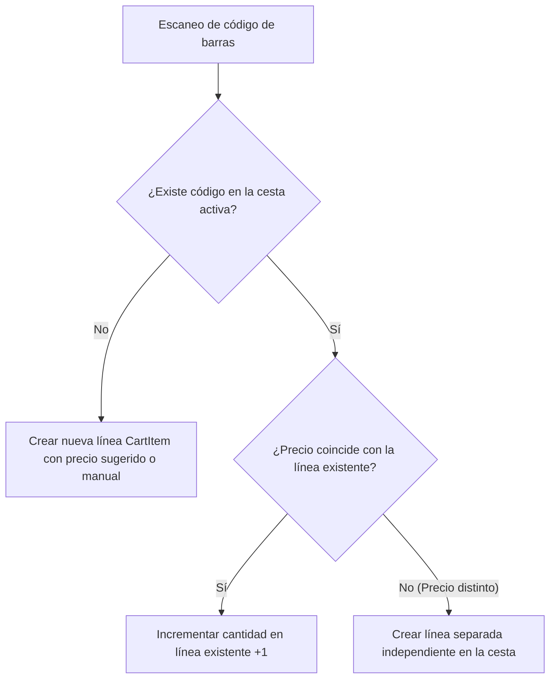

# 02. Especificación de Requisitos y Casos Frontera — CestaCuenta

## 1. Historias de Usuario (HU)

Las historias de usuario están formuladas según el estándar de desarrollo ágil, acompañadas de criterios de aceptación observables mediante la sintaxis *Dado-Cuando-Entonces* (Gherkin/BDD).

---

### HU-01: Añadir producto mediante escaneo de código de barras
- **Como:** Comprador en el pasillo del supermercado.
- **Quiero:** Apuntar la cámara de mi teléfono al código de barras de un artículo.
- **Para:** Incorporarlo a mi cesta de compra sin tener que escribir su nombre o buscarlo manualmente.

#### Criterios de Aceptación:
1. **Escaneo de producto registrado previamente:**
   - **Dado** que tengo la pantalla de escáner activa y el producto con código `8410123456789` ya fue guardado en el catálogo local con precio de 2,15 € ("Leche Entera 1L").
   - **Cuando** la cámara enfoca el código de barras.
   - **Entonces** el sistema reproduce una vibración háptica corta, incrementa la cesta con 1 unidad a 2,15 € (215 céntimos), muestra un mensaje temporal de confirmación con botón "Deshacer" y actualiza el Total Estimado inmediatamente.
2. **Escaneo de producto nuevo (sin registro previo en catálogo):**
   - **Dado** que escaneo un código de barras que no existe en el catálogo local ni en caché.
   - **Cuando** se detecta el código de barras con éxito.
   - **Entonces** el sistema abre de inmediato el modal de confirmación rápida con el foco puesto en el teclado numérico de precio, manteniendo el código visible y permitiendo guardar el producto con un solo toque tras introducir el importe.

---

### HU-02: Añadir producto manualmente sin código de barras
- **Como:** Comprador que adquiere productos frescos (frutería, panadería o artículos con etiquetas deterioradas).
- **Quiero:** Pulsar un botón de adición manual e introducir el nombre y el precio fijado en la báscula.
- **Para:** Incluir productos al peso o sin código en el cómputo total de mi compra.

#### Criterios de Aceptación:
1. **Flujo de entrada manual rápida:**
   - **Dado** que estoy en la pantalla de la cesta activa.
   - **Cuando** pulso el botón flotante o de acceso directo "+ Añadir manual".
   - **Entonces** se despliega una hoja modal inferior con el cursor en el campo de precio numérico, permitiendo opcionalmente escribir un nombre o seleccionar una categoría rápida ("Fruta/Verdura", "Panadería", "General").
2. **Confirmación con teclado numérico:**
   - **Dado** que introduzco el precio "1,87" y pulso la tecla "Añadir".
   - **Entonces** la línea se crea con subtotal 187 céntimos, la modal se cierra sin demoras y el Total Estimado suma 187 céntimos.

---

### HU-03: Modificar cantidad y precio unitario de una línea
- **Como:** Comprador que decide cambiar las unidades que va a llevar o detecta una variación de precio en el lineal.
- **Quiero:** Modificar la cantidad mediante botones rápidos o editar el precio unitario tocando la línea.
- **Para:** Reflejar con fidelidad lo que realmente llevo en el carro.

#### Criterios de Aceptación:
1. **Ajuste de cantidad con un toque:**
   - **Dado** un artículo en la cesta con cantidad 1 y precio unitario 150 céntimos.
   - **Cuando** pulso el botón `+` en la fila del artículo.
   - **Entonces** la cantidad pasa a 2, el subtotal de la línea pasa a 300 céntimos y el total de la cesta aumenta 150 céntimos de manera atómica.
2. **Reducción de cantidad a cero:**
   - **Dado** un artículo con cantidad 1.
   - **Cuando** pulso el botón `-`.
   - **Entonces** el sistema solicita confirmación rápida o elimina la línea mostrando la opción de "Deshacer" en una barra de aviso flotante durante 4 segundos.

---

### HU-04: Aplicación de descuentos y promociones
- **Como:** Comprador que aprovecha una oferta o cupón de descuento.
- **Quiero:** Restar un importe en céntimos a un producto concreto o aplicar un descuento global a la cesta.
- **Para:** Que el total estimado coincida exactamente con las promociones que se cobrarán en caja.

#### Criterios de Aceptación:
1. **Descuento por línea:**
   - **Dado** un producto con precio 300 céntimos y un cupón de 50 céntimos.
   - **Cuando** edito el producto e introduzco 50 céntimos en el campo de descuento.
   - **Entonces** el subtotal de la línea muestra 250 céntimos y el total de la cesta se ajusta a la baja en 50 céntimos.
2. **Línea de descuento global:**
   - **Dado** un cupón general del supermercado (ej. "5 € de descuento por compra superior a 40 €").
   - **Cuando** añado una línea de descuento global por 500 céntimos.
   - **Entonces** se crea un ítem especial en la cesta con importe negativo (-500 céntimos), reduciendo el Total Estimado en dicha cantidad, sin permitir que el total final sea inferior a 0 céntimos.

---

### HU-05: Finalización y archivado de la compra
- **Como:** Comprador que ha pasado por la caja registradora y pagado su compra.
- **Quiero:** Cerrar la sesión activa de compra con un solo botón y guardarla en mi histórico local.
- **Para:** Iniciar una cesta limpia en mi siguiente compra y conservar el registro de cuánto gasté hoy.

#### Criterios de Aceptación:
1. **Cierre de compra:**
   - **Dado** que tengo una cesta activa con 12 artículos y un total de 43,80 €.
   - **Cuando** pulso "Finalizar compra" y confirmo en el diálogo.
   - **Entonces** la sesión actual cambia su estado a `COMPLETED`, se guarda la marca de tiempo de cierre, la cesta activa queda vacía y lista para una nueva compra, y los precios unitarios quedan registrados en el catálogo local para futuras compras.

---

## 2. Requisitos Funcionales (RF)

| Código | Descripción Funcional | Prioridad |
| :--- | :--- | :--- |
| **RF-01** | El sistema debe capturar y decodificar códigos de barras 1D estándar en entornos minoristas: EAN-13, EAN-8, UPC-A y UPC-E mediante la cámara integrada. | Crítica (MVP) |
| **RF-02** | El sistema debe parsear cualquier entrada de precio en formato de texto a céntimos enteros (tipo de dato entero de 64 bits), admitiendo indistintamente coma `,` o punto `.` como delimitador decimal. | Crítica (MVP) |
| **RF-03** | El sistema debe mantener una vista persistente y visible del **"Total estimado"** en la parte inferior de la pantalla (*Sticky Bottom Bar*) durante toda la sesión activa. | Crítica (MVP) |
| **RF-04** | El sistema debe permitir la adición, edición de precio, ajuste de cantidad y eliminación de cualquier línea de compra de forma atómica. | Crítica (MVP) |
| **RF-05** | El sistema debe persistir de forma inmediata cada mutación de la cesta en la base de datos local (SQLite) mediante transacciones síncronas para evitar pérdida de datos ante cortes de energía o cierres forzados. | Crítica (MVP) |
| **RF-06** | El sistema debe implementar un catálogo local (*cache-aside*) que asocie códigos de barras con el último nombre y precio unitario asignados por el usuario. | Alta (MVP) |
| **RF-07** | El sistema debe proporcionar un botón de encendido y apagado de la linterna/antorcha en la pantalla del escáner para facilitar la lectura en condiciones de baja luminosidad. | Alta (MVP) |
| **RF-08** | El sistema debe implementar retroalimentación háptica (vibración de 100 ms) y auditiva opcional al confirmar una lectura correcta de código de barras. | Media (MVP) |
| **RF-09** | El sistema debe admitir artículos a granel donde el precio introducido sea el valor final liquidado por la báscula de la sección de frescos. | Alta (MVP) |
| **RF-10** | El sistema debe permitir aplicar descuentos en céntimos, tanto a nivel de línea de producto individual como mediante líneas de ajuste global negativas. | Alta (MVP) |
| **RF-11** | El sistema debe permitir consultar de forma asíncrona la API pública de Open Food Facts cuando se escanee un código nuevo desconocido, rellenando el nombre del producto de forma no bloqueante si hay conexión a internet disponible. | Media (Fase 3) |
| **RF-12** | El sistema debe almacenar el histórico de compras completadas con fecha, hora, número total de artículos y desglose completo de líneas. | Media (Fase 4) |
| **RF-13** | El sistema debe incluir una función de vaciado completo de la cesta activa, protegida por un modal de confirmación para evitar borrados accidentales. | Alta (MVP) |

---

## 3. Requisitos No Funcionales (RNF)

### 3.1 Rendimiento y Eficiencia
- **RNF-01 (Latencia de renderizado):** Toda mutación de cantidad o precio debe actualizar el árbol de componentes y reflejar el nuevo Total Estimado en pantalla en un tiempo inferior a **16 milisegundos** (equivalente a 60 fotogramas por segundo).
- **RNF-02 (Tiempo de arranque):** El tiempo de arranque en frío (*cold start*) hasta la disponibilidad interactiva de la cesta debe ser inferior a **800 milisegundos** en hardware de gama media (equivalente a Snapdragon 680 o Apple A12 Bionic).
- **RNF-03 (Uso de memoria):** El consumo de memoria RAM de la aplicación en ejecución continua no debe superar los **120 MB**, garantizando estabilidad en dispositivos con recursos limitados.

### 3.2 Fiabilidad y Resiliencia
- **RNF-04 (Persistencia ACID local):** El almacenamiento local debe operar bajo modo Write-Ahead Logging (WAL) en SQLite, asegurando que ante una terminación abrupta del proceso (*kill* por el sistema operativo) no exista corrupción de datos ni pérdida de ítems ya confirmados.
- **RNF-05 (Autonomía de red):** La aplicación debe ser 100% operativa en modo avión; la ausencia total de conectividad Wi-Fi o datos móviles no debe degradar ninguna función esencial del MVP ni mostrar diálogos intrusivos de desconexión.

### 3.3 Usabilidad y Accesibilidad
- **RNF-06 (Accesibilidad visual WCAG AAA):** El componente de visualización del **Total Estimado** debe cumplir con la directriz WCAG 2.1 nivel AAA, garantizando un ratio de contraste de color mínimo de **7:1** entre el texto del importe y su fondo en modos claro y oscuro.
- **RNF-07 (Área táctil mínima):** Todo elemento táctil interactivo (botones de incremento, decremento, escáner, teclado numérico y cierre) debe tener una superficie mínima interactiva de **$48 \times 48\text{ dp}$** (recomendado $56\text{ dp}$ para los botones principales de pasillo).
- **RNF-08 (Soporte para lectores de pantalla):** Todas las vistas deben contar con etiquetas semánticas descriptivas accesibles para VoiceOver (iOS) y TalkBack (Android), anunciando los cambios de importe total de manera comprensible para personas con discapacidad visual.

---

## 4. Especificación Detallada de Casos Frontera (Edge Cases)

### 4.1 Dos Unidades del Mismo Producto con Diferente Precio
- **Contexto del problema:** En supermercados es habitual que una unidad de un producto conserve el precio estándar (ej. Bandeja de pollo a 4,50 €) mientras que una segunda unidad del mismo producto idéntico (mismo código de barras EAN-13) tenga pegada una etiqueta adhesiva de liquidación por fecha de caducidad próxima con descuento (ej. 3,15 €).
- **Comportamiento defectuoso evitado:** La aplicación **NO** debe agrupar ciegamente los artículos por su código de barras si el precio unitario difiere.
- **Solución técnica implementada:**
  - La clave de unicidad para la agregación en la cesta no es únicamente el código de barras, sino la combinación compuesta de:
    $$\text{Clave de agregación} = \langle \text{barcode}, \text{unit\_price\_cents}, \text{discount\_cents} \rangle$$
  - Si se escanea un código de barras existente pero el usuario modifica el precio unitario de esa nueva unidad, el sistema genera automáticamente una **nueva línea independiente (`CartItem`)** en la cesta activa.
  - En la vista de cesta, se muestran como dos filas diferenciadas:
    - *Fila 1:* Pollo Fresco — 1 ud $\times$ 4,50 € = 4,50 €
    - *Fila 2:* Pollo Fresco (Oferta caducidad) — 1 ud $\times$ 3,15 € = 3,15 €



---

### 4.2 Parseo de Precio a Céntimos Enteros (Prohibición de Float/Double)
- **Riesgo crítico de dominio:** El uso de tipos de coma flotante binaria (estándar IEEE 754: `float`, `double`) introduce errores de aproximación acumulativos inadmisibles en software financiero (ej. `0.1 + 0.2 = 0.30000000000000004` o `1.45 * 100 = 144.99999999999997` que al truncar a entero produce 144 en lugar de 145).
- **Regla estricta:** Todas las cantidades monetarias dentro del modelo de datos, la lógica de cálculo y la base de datos se expresan como **números enteros (`int64`) que representan céntimos de la moneda**.

#### Algoritmo de Parseo Determinista:
La función de parseo `parsePriceToCents(String input) -> Result<int64, ParseError>` opera con las siguientes reglas:

```text
Entrada: Cadena de texto bruta introducida por el usuario o leída de OCR/báscula.

1. Sanitización:
   - Eliminar espacios en blanco iniciales, finales e intermedios.
   - Eliminar símbolos de moneda (€, $, £).
   - Reemplazar coma ',' por punto '.' para estandarizar el separador decimal.

2. Validación de formato mediante Expresión Regular estricta:
   Regex: ^([0-9]+)?(\.[0-9]{1,2})?$
   - Si no cumple o la cadena queda vacía -> Retornar Error de Formato Inválido.

3. Extracción de partes:
   - Dividir la cadena por el punto '.'.
   - Parte entera (unidades):
     * Si está ausente (ej. ".45" o ",99"), asignar 0.
     * Si está presente, parsear a entero base 10: integerPart = int.parse(parts[0]).
   - Parte decimal (fracción):
     * Si está ausente (ej. "5"), decimalPart = 0.
     * Si tiene 1 dígito (ej. "1.4"), decimalPart = int.parse(parts[1]) * 10.
     * Si tiene 2 dígitos (ej. "1.45"), decimalPart = int.parse(parts[1]).
     * Si tiene más de 2 dígitos, rechazar o truncar según regla estricta.

4. Cómputo final:
   cents = (integerPart * 100) + decimalPart.
   Retornar cents como entero de 64 bits.
```

#### Tabla de Pruebas de Normalización Monetaria:

| Entrada de Usuario | Interpretación | Entero en Céntimos (`int64`) | Representación Formateada en UI |
| :--- | :--- | :--- | :--- |
| `"1,45"` | 1 unidad y 45 céntimos | `145` | `"1,45 €"` |
| `"1.45"` | 1 unidad y 45 céntimos | `145` | `"1,45 €"` |
| `"1,4"` | 1 unidad y 40 céntimos | `140` | `"1,40 €"` |
| `"5"` | 5 unidades enteras | `500` | `"5,00 €"` |
| `"0,05"` | 5 céntimos | `5` | `"0,05 €"` |
| `",99"` / `".99"` | 99 céntimos | `99` | `"0,99 €"` |
| `"002,50"` | Cero a la izquierda sanitizado | `250` | `"2,50 €"` |
| `"0"` / `"0,00"` | Cero céntimos | `0` (Rechazado para unit_price) | Error: "El precio debe ser superior a cero" |
| `"abc"` / `"1,45,6"` | Malformado | N/A | Error: "Formato numérico no válido" |

---

### 4.3 Descuentos y Promociones

El sistema contempla dos categorías de bonificación económica:

1. **Descuento directo por línea (`CartItem.discount_cents`):**
   - Aplicable cuando un producto tiene una rebaja unitaria directa (ej. pegatina de "0,50 € de descuento").
   - La fórmula de cálculo del subtotal de línea es:
     $$\text{Subtotal Línea} = (\text{quantity} \times \text{unit\_price\_cents}) - \text{discount\_cents}$$
   - **Restricción de dominio:** $\text{discount\_cents} \le (\text{quantity} \times \text{unit\_price\_cents})$. El subtotal de una línea de producto nunca puede ser negativo.

2. **Línea de descuento o cupón general:**
   - Para promociones globales en el ticket (ej. cupón de bienvenida de 6,00 € en compras de hipermercado).
   - Se representa en el modelo de datos como un `CartItem` especial donde el indicador booleano `is_discount = true` y el campo `unit_price_cents` almacena un valor negativo (ej. `-600`).
   - **Regla de salvaguarda de cesta:**
     $$\text{Total Cesta Estimado} = \max\left(0, \sum_{i=1}^{N} \text{Subtotal}_i\right)$$
     El Total Estimado de la compra jamás mostrará un valor inferior a cero céntimos, independientemente de la magnitud de los cupones introducidos.

---

### 4.4 Fruta, Verdura y Productos al Peso (Granel)

Los artículos de frutería, carnicería y pescadería presentan dos modalidades en los puntos de venta:

1. **Modalidad A: Báscula con Código de Barras EAN-13 de Tienda (Prefijo '2'):**
   - Los supermercados emplean la norma EAN-13 con prefijo restringido nacional/interno (que comienza por el dígito `2`, típicamente `20` a `29`).
   - La estructura de estos códigos codifica internamente la referencia del artículo y el importe total liquidado o el peso:
     - Dígitos 1-2: Prefijo de peso variable (`21`, `22`, etc.).
     - Dígitos 3-7: Código del artículo interno de la tienda.
     - Dígitos 8-12: Importe en céntimos (ej. `00385` = 3,85 €) o peso en gramos.
     - Dígito 13: Dígito de control.
   - **Tratamiento en CestaCuenta:** El analizador de código de barras detecta si el código escaneado inicia por `2`. Si la tienda codifica el precio en los dígitos 8-12, el sistema sugiere automáticamente el importe extraído en céntimos para confirmación del usuario con un solo toque.

2. **Modalidad B: Báscula manual sin etiqueta o visor directo:**
   - El usuario pesa una bolsa de plátanos y el visor de la balanza indica: *"Importe: 2,14 €"*.
   - El usuario pulsa "+ Añadir manual", introduce "Plátanos" (o pulsa el botón rápido "Fruta") y teclea `2,14`.
   - Se crea una línea con `quantity = 1`, `is_bulk = true` y `unit_price_cents = 214`. No se obliga al usuario a calcular el precio por kilo ni a introducir gramos, optimizando el tiempo en tienda.

---

### 4.5 Escaneo Accidental Duplicado

- **Riesgo:** Las cámaras modernas operan a 30 o 60 cuadros por segundo. Si el usuario mantiene el producto frente al lente durante medio segundo, el decodificador podría procesar múltiples lecturas idénticas consecutivas.
- **Mecanismo de mitigación:**
  1. **Debounce temporal estricto (Ventana de 2000 ms):**
     - Tras decodificar con éxito un código $C$, el escáner bloquea cualquier nueva captura del mismo código $C$ durante un periodo de **2 segundos exactos**.
     - Códigos diferentes (ej. escanear el artículo $A$ y de inmediato el artículo $B$) se procesan sin retraso artificial, garantizando fluidez en escaneos secuenciales rápidos.
  2. **Incremento automático tras ventana de bloqueo:**
     - Si tras expirar los 2 segundos el usuario vuelve a enfocar deliberadamente el código $C$, el sistema interpreta una segunda unidad legítima e incrementa `quantity` en `+1`.
  3. **Retroalimentación y Deshacer Inmediato:**
     - Cada escaneo emite un pulso háptico distintivo.
     - Se despliega en la parte inferior un aviso flotante tipo *Snackbar* visible durante 4 segundos:
       > *"Añadido: Tomate Frito (2 uds en total) — [DESHACER]"*
     - Pulsar "Deshacer" restaura inmediatamente la cantidad anterior o elimina la línea sin salir de la pantalla de compra.

---

### 4.6 Código Ilegible y Permiso de Cámara Denegado o Ausente

1. **Código dañado o arrugado:**
   - La pantalla del escáner incluye en su borde inferior un acceso directo permanente de alta visibilidad: *"Introducir manualmente"*. Al pulsarlo, no se pierde el contexto y se abre el teclado numérico en menos de 100 ms.
2. **Permiso de cámara denegado por el usuario o hardware sin cámara:**
   - Si al iniciar la aplicación el usuario rechaza el permiso de acceso a la cámara en los diálogos del sistema operativo:
     - La app **no debe bloquearse**, ni cerrarse, ni insistir con alertas modales agresivas.
     - Se activa automáticamente el **"Modo sin cámara"**.
     - En este modo, el botón de acción principal de la pantalla principal se convierte en un botón prominente de adición manual (`+`) que despliega el teclado numérico directamente.
     - En la sección de configuración se muestra un indicador informativo sutil: *"Permiso de cámara desactivado. La app opera en modo manual. Puedes activarlo en los Ajustes del sistema"*.

---

### 4.7 Corrección de Precio Posterior a la Adición

- **Escenario:** El usuario añade un producto creyendo que costaba 1,20 €, pero al mirar la etiqueta del lineal o consultar la pantalla del supermercado observa que el precio real es 1,35 €.
- **Interacción:**
  - Tocar cualquier fila de la cesta activa abre de forma inmediata la hoja de edición de línea (*Edit Item Sheet*).
  - El campo de precio aparece pre-seleccionado con el valor actual.
  - El usuario escribe el nuevo valor (`1,35`) y pulsa "Guardar".
  - **Efecto de cálculo:** La base de datos local actualiza el registro `CartItem.unit_price_cents = 135`, recalcula atómicamente el subtotal de la línea y el Total Estimado de la sesión, actualizando también el precio de referencia en `ProductReference` para futuras visitas.

---

### 4.8 Diferencia entre el Total Estimado de la App y el Ticket Final

- **Causas objetivas de divergencia técnica en tienda:**
  - Redondeos internos en el software de la caja registradora en productos pesados al gramo.
  - Promociones de volumen que la cajera aplica solo al totalizar el ticket (ej. "3x2 en galletas").
  - Impuestos indirectos en regiones con desgloses específicos o recargos de bolsas plásticas no computadas en la cesta.
- **Medidas de mitigación en UI y responsabilidad:**
  1. **Nomenclatura rigurosa:** La interfaz de la aplicación rotula el importe en todo momento bajo el término inequívoco **"Total estimado"** (nunca "Total a pagar" ni "Importe oficial").
  2. **Micro-aviso pedagógico:** Un icono de información junto a la barra fija inferior permite ver un aviso conciso:
     > *"Este total es una estimación precisa basada en los importes registrados durante tu recorrido. El ticket oficial emitido por la caja registradora del establecimiento prevalece en todo momento."*
