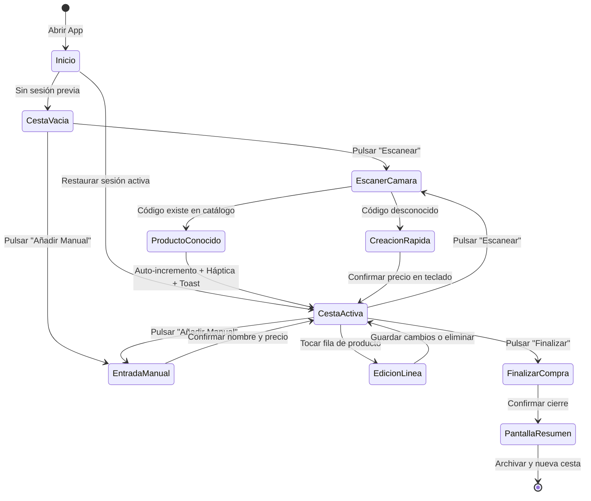

# 03. Flujos de Usuario, Pantallas y Accesibilidad — CestaCuenta

## 1. Recorrido Completo de la Compra (Paso a Paso)

El recorrido del usuario en CestaCuenta está optimizado para minimizar las interrupciones mecánicas durante el acto físico de compra en el supermercado.



---

### Descripción del Flujo Secuencial:

1. **Apertura de la aplicación e hidratación de estado:**
   - La aplicación arranca en frío o caliente. Consulta de manera síncrona/reactiva a la base de datos local (SQLite).
   - Si existe una sesión de compra con estado `ACTIVE`, se restaura exactamente como se dejó (líneas, cantidades, subtotales). Si no, se inicializa automáticamente una nueva sesión limpia.
2. **Ciclo iterativo de captura en pasillo (Bucle principal):**
   - **Vía Escáner:** El usuario apunta al código de barras del producto.
     - *Caso conocido:* El sistema detecta el código, emite vibración, incrementa la cantidad en la cesta y muestra un aviso con opción "Deshacer". El usuario sigue caminando sin tocar la pantalla.
     - *Caso nuevo:* Se abre la ventana modal de confirmación rápida; el usuario teclea el precio de la etiqueta de la estantería (ej. `1,25`) y pulsa "Añadir".
   - **Vía Manual:** Para frutas, verduras o panadería, el usuario pulsa "+", escribe "Manzanas", teclea el precio fijado por la báscula y confirma.
3. **Monitoreo continuo del Total Estimado:**
   - Durante todo el recorrido, la barra inferior fija muestra el acumulado en tiempo real. El usuario compara este dato con su presupuesto mental o lista previa.
4. **Cotejo en caja registradora:**
   - Al llegar a la cinta de caja, el usuario visualiza la lista en pantalla y compara los precios conforme el personal de caja va escaneando los artículos.
5. **Cierre de compra:**
   - El usuario pulsa "Finalizar compra". Se presenta el resumen total de la sesión. Al aceptar, la sesión pasa a estado `COMPLETED` y queda almacenada en el histórico local, limpiando la pantalla para la siguiente jornada.

---

## 2. Especificación Detallada de Pantallas Mínimas

### 2.1 Pantalla Principal: Cesta Activa (Home)

Es el panel de control permanente. Mantiene la lista de artículos y la barra persistente de total.

#### Estructura y Distribución de la Interfaz (Wireframe Conceptual):
```text
+-------------------------------------------------------+
| [CestaCuenta]                    (12 arts)  [Ajustes] |  <- Barra Superior (AppBar)
+-------------------------------------------------------+
|  [!] Modo sin cámara activo (solo si aplica)         |  <- Banner contextual (si procede)
+-------------------------------------------------------+
|  Leche Entera 1L                           2,15 €     |
|  8410123456789                                        |
|  [-]  [ 2 ]  [+]                         Sub: 4,30 €  |  <- Tarjeta de Ítem (CartItem)
|  ...................................................  |
|  Plátanos de Canarias                      1,87 €     |
|  Granel / Báscula                                     |
|  [-]  [ 1 ]  [+]                         Sub: 1,87 €  |
|  ...................................................  |
|  Cupón Descuento 5€                       -5,00 €     |
|  Promoción general                                    |
|  [x] Eliminar                           Sub: -5,00 €  |
|                                                       |
|                                                       |
|                                                       |  <- Área scrollable con padding inferior
+-------------------------------------------------------+
|  TOTAL ESTIMADO (15 artículos)             23,45 €    |  <- Barra Fija (Sticky Bottom Bar)
|  [!] El ticket final prevalece.                       |     Contraste WCAG AAA (7:1)
+-------------------------------------------------------+
|  [ + Manual ]      [ Escanear Código ]     [ Cobro ]  |  <- Botones de acción principal (>=48dp)
+-------------------------------------------------------+
```

#### Componentes Clave:
- **Barra Superior (AppBar):** Nombre de la app, contador total de unidades y acceso a menú de histórico y vaciado de cesta.
- **Lista de Artículos Virtualizada:** Implementada mediante listas perezosas (`ListView.builder` o `FlatList`) con reciclado de celdas para garantizar 60 fps constantes con más de 200 ítems.
- **Tarjeta de Línea (`CartItemCard`):** Muestra título del producto, precio unitario, botones táctiles grandes para decrementar `[-]` e incrementar `[+]`, y subtotal de la línea en negrita.
- **Barra Fija Inferior (*Sticky Bottom Sheet*):**
  - Anclada permanentemente al fondo; no se oculta al desplazar la lista.
  - Indicador numérico en tipografía robusta (mínimo 28sp).
  - Micro-aviso pedagógico *"Total estimado"*.
  - Botón principal de **Escanear** en posición central optimizada para el pulgar.

---

### 2.2 Modal de Escáner de Cámara

Se despliega a pantalla completa o modal expandida (90% del alto) para focalizar la atención del sensor óptico.

#### Estructura de la Interfaz:
```text
+-------------------------------------------------------+
| [X Cerrar]                      [Flash: ON/OFF]       |  <- Cabecera de control
+-------------------------------------------------------+
|                                                       |
|                                                       |
|             +---------------------------+             |
|             | ┌                       ┐ |             |
|             |                           |             |  <- Cuadro de enfoque activo
|             |         [ Línea ]         |             |     (Retícula con animación sutil)
|             |                           |             |
|             | └                       ┘ |             |
|             +---------------------------+             |
|                                                       |
|         Apunta al código de barras del producto       |
|                                                       |
+-------------------------------------------------------+
|  [ Teclado manual: Introducir código o producto ]     |  <- Fallback accesible directo
+-------------------------------------------------------+
```

#### Requisitos de Operación:
- **Luz de Antorcha (Flash):** Botón alternable en la esquina superior derecha con icono claro y retroalimentación de estado.
- **Retícula de Escaneo:** Indicador visual de encuadre en el tercio superior/medio de la pantalla para evitar tapar el objetivo con la mano que sostiene el producto.
- **Debounce y Bloqueo:** El flujo de fotogramas del escáner ignora el mismo código durante 2000 ms tras una lectura correcta.

---

### 2.3 Modal de Confirmación / Creación Rápida

Se presenta cuando se escanea un código no registrado previamente en el catálogo local o al pulsar "+ Manual".

#### Estructura de la Interfaz:
```text
+-------------------------------------------------------+
| Nuevo Producto                                [Cerrar]|
+-------------------------------------------------------+
| Código: 8480000123456 (Opcional)                      |
| Nombre: [ Atún Claro en Aceite de Oliva         ]     |
|         (Sugerencias: Fruta, Pan, Bebida, Limpieza)   |
|                                                       |
| PRECIO (€):                                           |
| +---------------------------------------------------+ |
| |                    1,45 €                         | |  <- Campo de importe de alto impacto
| +---------------------------------------------------+ |
|                                                       |
|  [ 1 ]    [ 2 ]    [ 3 ]                              |
|  [ 4 ]    [ 5 ]    [ 6 ]                              |  <- Teclado numérico in-app
|  [ 7 ]    [ 8 ]    [ 9 ]                              |     (Teclas de 60dp de altura)
|  [ , ]    [ 0 ]    [ ⌫ ]                              |
|                                                       |
|  [          AÑADIR A LA CESTA (1,45 €)             ]  |  <- Botón primario de confirmación
+-------------------------------------------------------+
```

#### Características:
- Teclado numérico propio optimizado: evita la variabilidad de teclados del sistema operativo, garantizando una tecla de coma decimal dedicada sin caracteres alfabéticos innecesarios.
- Al pulsar "Añadir a la cesta", se guarda la referencia en el catálogo local y se incorpora la línea a la cesta en una sola transacción atómica.

---

### 2.4 Modal de Edición de Línea de Cesta

Permite ajustar detalles de un producto ya incorporado a la cesta activa.

#### Estructura de la Interfaz:
```text
+-------------------------------------------------------+
| Modificar Producto                            [Cerrar]|
+-------------------------------------------------------+
| Nombre: Leche Entera 1L                               |
| Código: 8410123456789                                 |
|                                                       |
| Cantidad:      [-]       [   2   ]       [+]          |
|                                                       |
| Precio Unitario (€):    [ 2,15                      ] |
| Descuento Línea (€):    [ 0,00                      ] |
|                                                       |
| Subtotal de línea calculado:                  4,30 €  |
|                                                       |
| [ Guardar Cambios ]       [ Eliminar de la Cesta ]    |
+-------------------------------------------------------+
```

---

### 2.5 Pantalla de Finalización y Resumen de Compra

Se muestra al concluir la compra física para cotejo final y archivado.

#### Estructura de la Interfaz:
```text
+-------------------------------------------------------+
| [<- Volver]            Resumen de Compra              |
+-------------------------------------------------------+
|                                                       |
|                  TOTAL ESTIMADO                       |
|                     43,80 €                           |
|                                                       |
|   Fecha: 27/09/2026 11:15                             |
|   Líneas: 14 productos    |    Artículos totales: 18  |
|                                                       |
|   Desglose principal:                                 |
|   - 14 productos en cesta                    48,80 €  |
|   - Descuentos aplicados                     -5,00 €  |
|   -------------------------------------------------   |
|   Total a contrastar con ticket:             43,80 €  |
|                                                       |
| [ Guardar y Empezar Nueva Compra ]                    |
| [ Exportar Detalle (Texto plano / CSV) ]              |
+-------------------------------------------------------+
```

---

## 3. Estados de la Interfaz, Manejo de Errores y Recuperación

| Estado | Situación Detonante | Representación en UI | Estrategia de Recuperación |
| :--- | :--- | :--- | :--- |
| **Cesta Vacía (Empty State)** | Inicio de compra o cesta recién vaciada. | Icono ilustrativo minimalista de carro, texto claro: *"Tu cesta está vacía. Escanea un producto o introduce un importe para empezar."* Dos botones de acción directa: `[Escanear]` y `[Añadir Manual]`. | El usuario pulsa cualquiera de los botones para comenzar inmediatamente. |
| **Cámara Denegada** | El usuario rechazó el permiso de hardware. | Se oculta el botón de cámara de la barra fija o se sustituye por un icono informativo sutil. La UI prioriza la entrada manual. | La app sigue operando al 100% de su capacidad funcional mediante el teclado manual numérico. |
| **Lectura Ilegible o Código No Reconocido** | Código rayado, deformado o con reflejos. | La retícula de escaneo parpadea en color amarillo neutro tras 3 segundos de enfoque sin éxito y muestra un botón flotante: *"¿No enfoca? Escribir código"*. | Apertura inmediata del teclado manual sin salir del flujo de adición. |
| **Precio Inválido ("0,00 €")** | Usuario pulsa añadir sin indicar un precio o introduce un formato no admitido. | El botón de "Añadir a la cesta" permanece inactivo (deshabilitado con contraste adecuado) y se muestra un micro-texto de advertencia: *"Introduce un precio superior a 0"*. | El usuario introduce un valor numérico válido y el botón se activa automáticamente. |
| **Cierre Inesperado de App (Crash / Batería)** | El sistema operativo liquida el proceso en segundo plano o el dispositivo se apaga por batería. | Al reiniciar la aplicación, la sesión activa se restaura íntegra a partir de la base de datos SQLite en modo WAL. | Totalmente transparente para el usuario; cero pérdida de ítems ya ingresados. |

---

## 4. Accesibilidad y Ergonomía (WCAG 2.1 AAA)

### 4.1 Requisitos de Contraste Cromático
- **Total Estimado:** El componente numérico central y la etiqueta "Total estimado" deben ofrecer un ratio de contraste de al menos **$7:1$** frente al fondo tanto en modo claro como en modo oscuro.
  - *Modo Claro:* Texto en `#0F172A` (Slate 900) sobre fondo `#F8FAFC` (Slate 50) o tarjeta blanca `#FFFFFF` (Ratio de contraste: **$16{,}2:1$**).
  - *Modo Oscuro:* Texto en `#F8FAFC` (Slate 50) sobre fondo `#020617` (Slate 950) (Ratio de contraste: **$18{,}5:1$**).

### 4.2 Dimensiones de Áreas Táctiles (Touch Targets)
- Ningún elemento interactivo en pantalla tendrá una caja de impacto inferior a **$48 \times 48\text{ dp}$**.
- Los botones críticos de operación con una sola mano en pasillo (`[Escanear]`, `[+]`, `[-]` y teclas del teclado numérico) tendrán una dimensión mínima recomendada de **$56 \times 56\text{ dp}$**, con una separación mínima de $8\text{ dp}$ entre elementos colindantes para evitar pulsaciones erróneas.

### 4.3 Semántica para Lectores de Pantalla (VoiceOver y TalkBack)
- **Áreas activas dinámicas (`accessibilityLiveRegion` / `aria-live`):** El Total Estimado está marcado como región viva de tipo *polite*. Cada vez que se añade, modifica o elimina un ítem, el lector anuncia de forma inteligible:
  > *"Total estimado actualizado: veintitrés euros con cuarenta y cinco céntimos. Quince artículos en la cesta."*
- **Botones de incremento y decremento:** Cuentan con etiquetas semánticas explícitas que incluyen el nombre del artículo:
  - Etiqueta del botón `+`: `"Añadir otra unidad de Leche Entera 1 Litro"`.
  - Etiqueta del botón `-`: `"Quitar una unidad de Leche Entera 1 Litro"`.
- **Adaptabilidad a Texto Dinámico:** La interfaz respeta el escalado de fuentes del sistema operativo (hasta un 200% de tamaño aumentado) sin truncar el Total Estimado ni solapar elementos interactivos.
