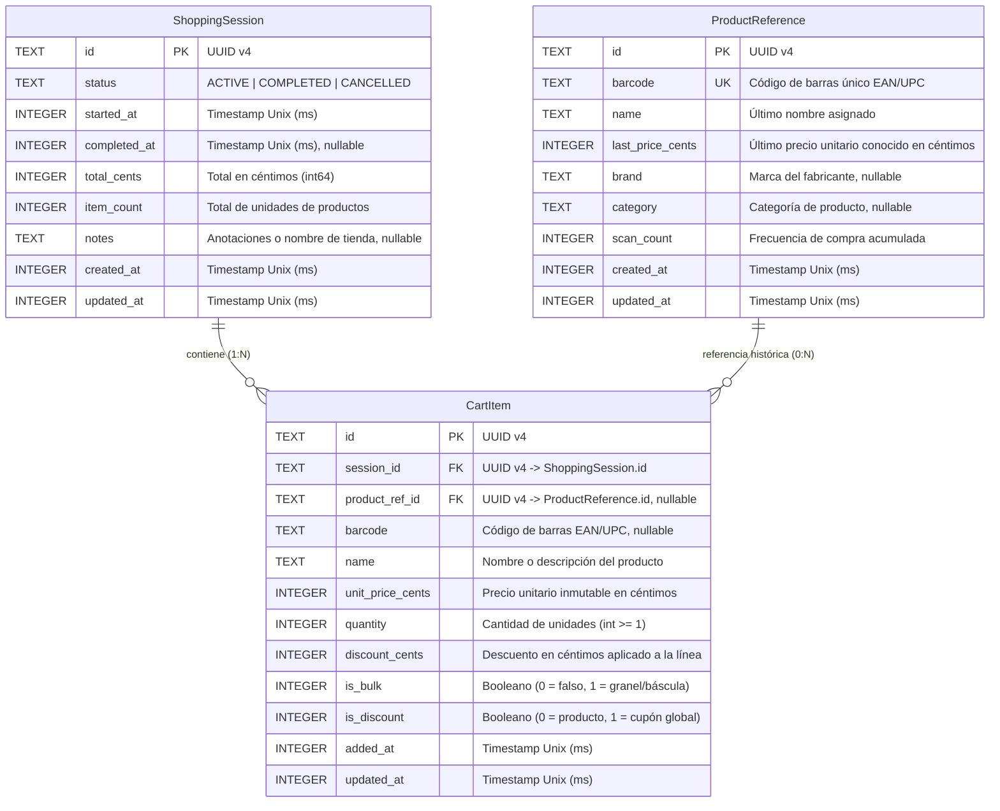

# 04. Modelo de Datos y Lógica Financiera — CestaCuenta

## 1. Diagrama Entidad-Relación (ERD)

El modelo de datos de CestaCuenta está estructurado bajo principios relacionales normalizados, optimizado para operaciones atómicas de lectura y escritura en almacenamiento local SQLite.



---

## 2. Definición Detallada de Entidades y Campos

### 2.1 Entidad: `ShoppingSession`
Representa una sesión de compra en el supermercado, desde que el usuario inicia el recorrido hasta que concluye el cotejo en caja.

| Campo | Tipo SQL | Restricciones | Descripción |
| :--- | :--- | :--- | :--- |
| `id` | `TEXT` | `PRIMARY KEY` | Identificador único universal (UUID v4) en formato canónico de 36 caracteres. |
| `status` | `TEXT` | `NOT NULL`, `CHECK(status IN ('ACTIVE', 'COMPLETED', 'CANCELLED'))` | Estado del ciclo de vida de la sesión. Solo puede existir una sesión en estado `ACTIVE` a la vez. |
| `started_at` | `INTEGER` | `NOT NULL` | Marca de tiempo Unix en milisegundos de la apertura de la sesión. |
| `completed_at` | `INTEGER` | `NULL` | Marca de tiempo Unix en milisegundos de cierre. Nulo mientras esté activa. |
| `total_cents` | `INTEGER` | `NOT NULL`, `DEFAULT 0`, `CHECK(total_cents >= 0)` | Sumatorio total liquidado de la sesión en céntimos enteros. |
| `item_count` | `INTEGER` | `NOT NULL`, `DEFAULT 0`, `CHECK(item_count >= 0)` | Conteo agregado del número de unidades físicas en la cesta. |
| `notes` | `TEXT` | `NULL` | Campo opcional para nombre del supermercado (ej. "Mercadona Centro") o recordatorio. |
| `created_at` | `INTEGER` | `NOT NULL` | Timestamp Unix de inserción del registro en base de datos. |
| `updated_at` | `INTEGER` | `NOT NULL` | Timestamp Unix de la última mutación de la sesión. |

---

### 2.2 Entidad: `CartItem`
Representa una línea individual dentro de una sesión de compra activa o histórica.

| Campo | Tipo SQL | Restricciones | Descripción |
| :--- | :--- | :--- | :--- |
| `id` | `TEXT` | `PRIMARY KEY` | Identificador único universal (UUID v4) de la línea. |
| `session_id` | `TEXT` | `NOT NULL`, `FOREIGN KEY REFERENCES ShoppingSession(id) ON DELETE CASCADE` | Vínculo con la sesión de compra a la que pertenece esta línea. |
| `product_ref_id` | `TEXT` | `NULL`, `FOREIGN KEY REFERENCES ProductReference(id) ON DELETE SET NULL` | Vínculo histórico opcional con la ficha del catálogo local. |
| `barcode` | `TEXT` | `NULL` | Código de barras del artículo (EAN-13, EAN-8, UPC). Nulo en artículos manuales. |
| `name` | `TEXT` | `NOT NULL`, `CHECK(length(trim(name)) > 0)` | Nombre o descripción visible del artículo. |
| `unit_price_cents`| `INTEGER` | `NOT NULL` | **Precio unitario congelado en céntimos.** Admite valores negativos si `is_discount = 1`. |
| `quantity` | `INTEGER` | `NOT NULL`, `DEFAULT 1`, `CHECK(quantity >= 1)` | Número de unidades enteras de este producto con idéntico precio. |
| `discount_cents` | `INTEGER` | `NOT NULL`, `DEFAULT 0`, `CHECK(discount_cents >= 0)` | Descuento total aplicado a esta línea en céntimos. |
| `is_bulk` | `INTEGER` | `NOT NULL`, `DEFAULT 0`, `CHECK(is_bulk IN (0, 1))` | Indicador de artículo al peso o a granel (1 = sí, 0 = no). |
| `is_discount` | `INTEGER` | `NOT NULL`, `DEFAULT 0`, `CHECK(is_discount IN (0, 1))` | Indicador de línea de descuento general (1 = cupón/ajuste, 0 = producto estándar). |
| `added_at` | `INTEGER` | `NOT NULL` | Timestamp Unix de incorporación del ítem a la cesta. |
| `updated_at` | `INTEGER` | `NOT NULL` | Timestamp Unix de la última modificación de cantidad o precio. |

---

### 2.3 Entidad: `ProductReference`
Catálogo local de productos persistente (*cache-aside*). Almacena el conocimiento acumulado del usuario para autocompletar nombres y sugerir precios cuando se vuelva a escanear un código de barras.

| Campo | Tipo SQL | Restricciones | Descripción |
| :--- | :--- | :--- | :--- |
| `id` | `TEXT` | `PRIMARY KEY` | Identificador único universal (UUID v4) del producto en el catálogo. |
| `barcode` | `TEXT` | `NOT NULL`, `UNIQUE` | Código de barras indexado de forma única para búsquedas $O(1)$. |
| `name` | `TEXT` | `NOT NULL` | Último nombre conocido o verificado por el usuario. |
| `last_price_cents`| `INTEGER` | `NOT NULL`, `CHECK(last_price_cents > 0)` | Último precio unitario en céntimos que se pagó por este código. |
| `brand` | `TEXT` | `NULL` | Marca comercial del producto si fue obtenida de Open Food Facts o escrita. |
| `category` | `TEXT` | `NULL` | Categoría opcional (Lácteos, Bebidas, etc.). |
| `scan_count` | `INTEGER` | `NOT NULL`, `DEFAULT 1` | Contador acumulado de veces que el usuario ha comprado este producto. |
| `created_at` | `INTEGER` | `NOT NULL` | Fecha de creación del registro. |
| `updated_at` | `INTEGER` | `NOT NULL` | Fecha de la última actualización de nombre o precio. |

---

## 3. Esquema DDL en SQLite con Restricciones e Índices

A continuación se detalla la definición de esquema SQL estándar para SQLite:

```sql
-- Habilitar integridad referencial en SQLite
PRAGMA foreign_keys = ON;

-- Tabla: Sesiones de Compra
CREATE TABLE IF NOT EXISTS shopping_sessions (
    id TEXT PRIMARY KEY NOT NULL,
    status TEXT NOT NULL CHECK(status IN ('ACTIVE', 'COMPLETED', 'CANCELLED')),
    started_at INTEGER NOT NULL,
    completed_at INTEGER,
    total_cents INTEGER NOT NULL DEFAULT 0 CHECK(total_cents >= 0),
    item_count INTEGER NOT NULL DEFAULT 0 CHECK(item_count >= 0),
    notes TEXT,
    created_at INTEGER NOT NULL,
    updated_at INTEGER NOT NULL
);

-- Índice parcial único: Garantiza que solo existe una sesión ACTIVE simultáneamente
CREATE UNIQUE INDEX IF NOT EXISTS uq_active_session 
ON shopping_sessions (status) 
WHERE status = 'ACTIVE';

-- Tabla: Catálogo Local de Productos
CREATE TABLE IF NOT EXISTS product_references (
    id TEXT PRIMARY KEY NOT NULL,
    barcode TEXT NOT NULL UNIQUE,
    name TEXT NOT NULL,
    last_price_cents INTEGER NOT NULL CHECK(last_price_cents > 0),
    brand TEXT,
    category TEXT,
    scan_count INTEGER NOT NULL DEFAULT 1,
    created_at INTEGER NOT NULL,
    updated_at INTEGER NOT NULL
);

-- Índice para resolución instantánea de código de barras
CREATE INDEX IF NOT EXISTS idx_product_references_barcode 
ON product_references (barcode);

-- Tabla: Líneas de la Cesta
CREATE TABLE IF NOT EXISTS cart_items (
    id TEXT PRIMARY KEY NOT NULL,
    session_id TEXT NOT NULL,
    product_ref_id TEXT,
    barcode TEXT,
    name TEXT NOT NULL CHECK(length(trim(name)) > 0),
    unit_price_cents INTEGER NOT NULL,
    quantity INTEGER NOT NULL DEFAULT 1 CHECK(quantity >= 1),
    discount_cents INTEGER NOT NULL DEFAULT 0 CHECK(discount_cents >= 0),
    is_bulk INTEGER NOT NULL DEFAULT 0 CHECK(is_bulk IN (0, 1)),
    is_discount INTEGER NOT NULL DEFAULT 0 CHECK(is_discount IN (0, 1)),
    added_at INTEGER NOT NULL,
    updated_at INTEGER NOT NULL,
    FOREIGN KEY (session_id) REFERENCES shopping_sessions (id) ON DELETE CASCADE,
    FOREIGN KEY (product_ref_id) REFERENCES product_references (id) ON DELETE SET NULL,
    CHECK (
        (is_discount = 1 AND unit_price_cents < 0) OR 
        (is_discount = 0 AND unit_price_cents > 0)
    ),
    CHECK (
        is_discount = 1 OR discount_cents <= (unit_price_cents * quantity)
    )
);

-- Índices de consulta para la cesta activa
CREATE INDEX IF NOT EXISTS idx_cart_items_session_id 
ON cart_items (session_id);

CREATE INDEX IF NOT EXISTS idx_cart_items_barcode_session 
ON cart_items (session_id, barcode);
```

---

## 4. Reglas de Cálculo Financiero y Consistencia de Precios

### 4.1 Principio de Inmutabilidad de Precio en `CartItem`
- **Problema de diseño evitado:** Si un `CartItem` simplemente apuntase por clave foránea a un precio en `ProductReference`, cualquier actualización futura del precio en el catálogo local (ej. la leche sube de 2,15 € a 2,25 € la semana que viene) alteraría retroactivamente los totales de compras históricas o de la cesta en curso.
- **Regla inmutable:** Cada fila en `CartItem` almacena una copia **inmutable y desacoplada** del precio unitario (`unit_price_cents`) en el instante exacto en que el usuario introdujo el producto en la cesta.
- Modificar o actualizar `ProductReference.last_price_cents` **jamás propaga mutaciones automáticas** sobre registros de `CartItem` existentes.

---

### 4.2 Aritmética Financiera en Céntimos Enteros

Toda operación matemática en el dominio de la aplicación utiliza exclusivamente números enteros de 64 bits (`int64` / `INTEGER`).

#### 1. Subtotal de Línea ($Subtotal_{line}$):
Para un artículo de producto estándar (`is_discount = 0`):
$$\text{Subtotal}_{line} = (\text{quantity} \times \text{unit\_price\_cents}) - \text{discount\_cents}$$

Para una línea de cupón general (`is_discount = 1`, donde `quantity = 1` y `unit_price_cents < 0`):
$$\text{Subtotal}_{line} = \text{unit\_price\_cents}$$

#### 2. Total de la Sesión ($Total_{session}$):
Sea $N$ el número total de líneas en la sesión:
$$\text{Total Bruto} = \sum_{i=1}^{N} \text{Subtotal}_{line, i}$$
$$\text{Total Estimado Final} = \max(0, \text{Total Bruto})$$

#### 3. Conteo Total de Artículos ($ItemCount_{session}$):
$$\text{ItemCount} = \sum_{i=1, \text{is\_discount}=0}^{N} \text{quantity}_i$$
*(Los cupones de descuento no incrementan el conteo de artículos físicos).*

---

### 4.3 Tratamiento de Productos al Peso y a Granel

Para no romper el paradigma de enteros en céntimos ni recurrir a cantidades fraccionarias en coma flotante (evitando almacenar `quantity = 1.345 kg`), CestaCuenta define la siguiente arquitectura para granel:

1. **Estrategia por Defecto (Precio Directo de Balanza):**
   - El usuario introduce en la cesta el importe total que arroja el ticket de la balanza para esa bolsa.
   - `quantity = 1`
   - `is_bulk = 1`
   - `unit_price_cents = precio_etiqueta_centimos`
   - *Ventaja:* 100% libre de errores de redondeo, no requiere que el usuario calcule o introduzca el peso en gramos.

2. **Estrategia Avanzada por Peso en Gramos (Cálculo Opcional en UI):**
   - Si la interfaz asiste al usuario para calcular el importe a partir del precio por kilogramo y el peso:
     - El peso se almacena en gramos enteros: $P_{gramos} \in \mathbb{N}$ (ej. 1345 g).
     - El precio por kilo se define en céntimos por kilogramo: $K_{cents} \in \mathbb{N}$ (ej. 2,99 €/kg = 299 céntimos).
   - **Fórmula de División Entera con Redondeo Simétrico:**
     $$\text{Importe Línea} = \left\lfloor \frac{(P_{gramos} \times K_{cents}) + 500}{1000} \right\rfloor$$
     *(El término $+500$ realiza el redondeo al entero más cercano antes de la división entera truncada por 1000, eliminando cualquier operación de coma flotante).*

---

## 5. Transacciones y Disparadores (Triggers) de Consistencia en SQLite

Para garantizar que los campos agregados de la sesión (`total_cents`, `item_count`, `updated_at`) permanezcan permanentemente sincronizados incluso ante inserciones directas, se definen disparadores atómicos en la base de datos:

```sql
-- Disparador: Recalcular totales tras insertar una línea
CREATE TRIGGER IF NOT EXISTS trg_after_insert_cart_item
AFTER INSERT ON cart_items
BEGIN
    UPDATE shopping_sessions 
    SET 
        total_cents = MAX(0, (
            SELECT COALESCE(SUM(
                CASE 
                    WHEN is_discount = 1 THEN unit_price_cents
                    ELSE (unit_price_cents * quantity) - discount_cents
                END
            ), 0)
            FROM cart_items 
            WHERE session_id = NEW.session_id
        )),
        item_count = (
            SELECT COALESCE(SUM(quantity), 0)
            FROM cart_items
            WHERE session_id = NEW.session_id AND is_discount = 0
        ),
        updated_at = strftime('%s', 'now') * 1000
    WHERE id = NEW.session_id;
END;

-- Disparador: Recalcular totales tras modificar una línea
CREATE TRIGGER IF NOT EXISTS trg_after_update_cart_item
AFTER UPDATE ON cart_items
BEGIN
    UPDATE shopping_sessions 
    SET 
        total_cents = MAX(0, (
            SELECT COALESCE(SUM(
                CASE 
                    WHEN is_discount = 1 THEN unit_price_cents
                    ELSE (unit_price_cents * quantity) - discount_cents
                END
            ), 0)
            FROM cart_items 
            WHERE session_id = NEW.session_id
        )),
        item_count = (
            SELECT COALESCE(SUM(quantity), 0)
            FROM cart_items
            WHERE session_id = NEW.session_id AND is_discount = 0
        ),
        updated_at = strftime('%s', 'now') * 1000
    WHERE id = NEW.session_id;
END;

-- Disparador: Recalcular totales tras eliminar una línea
CREATE TRIGGER IF NOT EXISTS trg_after_delete_cart_item
AFTER DELETE ON cart_items
BEGIN
    UPDATE shopping_sessions 
    SET 
        total_cents = MAX(0, (
            SELECT COALESCE(SUM(
                CASE 
                    WHEN is_discount = 1 THEN unit_price_cents
                    ELSE (unit_price_cents * quantity) - discount_cents
                END
            ), 0)
            FROM cart_items 
            WHERE session_id = OLD.session_id
        )),
        item_count = (
            SELECT COALESCE(SUM(quantity), 0)
            FROM cart_items
            WHERE session_id = OLD.session_id AND is_discount = 0
        ),
        updated_at = strftime('%s', 'now') * 1000
    WHERE id = OLD.session_id;
END;
```
