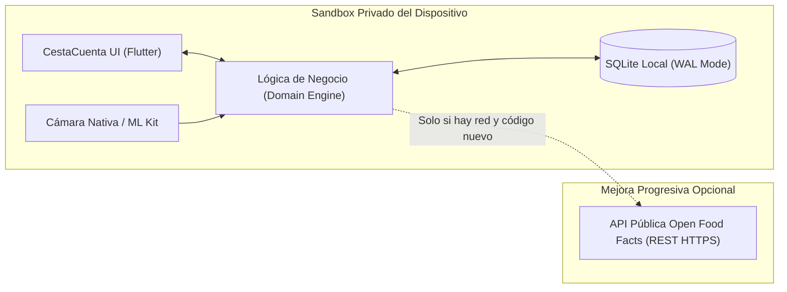

# 05. Decisiones Técnicas y Comparativa de Arquitectura — CestaCuenta

## 1. Introducción y Contexto de Evaluación

El éxito operativo de CestaCuenta depende críticamente de dos factores que ocurren en el entorno hostil del supermercado:
1. **Rendimiento óptico instantáneo de la cámara:** Decodificación de códigos de barras en milisegundos bajo iluminación heterogénea o reflejos plásticos.
2. **Persistencia offline 100% fiable:** Garantía de que los datos de la cesta y el catálogo histórico jamás se borrarán de forma arbitraria por el sistema operativo o el navegador.

A continuación se realiza una evaluación de arquitectura comparando una solución basada en **Progressive Web App (PWA)** frente a una solución de **Aplicación Móvil Multiplataforma Compilada (Flutter / React Native)**.

---

## 2. Comparativa Técnica Profunda: PWA vs App Multiplataforma

### 2.1 Tabla Resumen de Criterios

| Criterio Técnico | Progressive Web App (PWA) | App Multiplataforma (Flutter / React Native) | Veredicto |
| :--- | :--- | :--- | :--- |
| **Acceso a Cámara y Rendimiento de Escaneo** | Mediante `getUserMedia()` y Barcode Detection API (Shape Detection). Rendimiento dependiente del motor JS del navegador; framerate inestable en gamas bajas; control limitado o nulo de la antorcha/linterna en Safari iOS. | Acceso directo a pipelines nativos de hardware (CameraX en Android, AVFoundation en iOS). Decodificación con Google ML Kit / ZXing a 60 fps constantes. Control total de linterna, enfoque continuo y exposición. | **Ventaja crítica: Multiplataforma** |
| **Persistencia Offline y Riesgo de Desalojo** | Depende de IndexedDB / Cache Storage. **Riesgo crítico de "Storage Eviction" en Safari iOS**: Apple purga el almacenamiento de sitios web no visitados tras 7 días o ante presión de almacenamiento en el dispositivo. | Base de datos SQLite embebida en el sandbox privado del sistema operativo (`data/user/0` en Android, `Library/Application Support` en iOS). Cero riesgo de desalojo por parte del navegador. Persistencia permanente garantizada. | **Ventaja crítica: Multiplataforma** |
| **Retroalimentación Háptica y UX Física** | API `navigator.vibrate()` con soporte irregular (bloqueada o no implementada en Safari iOS para páginas web estándar). | Motores hápticos nativos del sistema (CoreHaptics en iOS, Vibrator en Android) con micro-pulsaciones de precisión al detectar el código. | **Ventaja: Multiplataforma** |
| **Distribución y Adopción de Usuario** | URL directa, sin comisiones de tiendas de aplicaciones. Fricción alta en iOS para instalación (menú Compartir -> "Añadir a pantalla de inicio"). Cero visibilidad orgánica en Google Play / App Store. | Instalación estándar en 1 toque desde Google Play Store y Apple App Store. Presencia en buscadores de tiendas, pero requiere cuentas de desarrollador y revisión de publicación. | **Empate táctico según estrategia** |
| **Costes Iniciales y Mantenimiento** | Cero costes de cuentas de desarrollador (no requiere 99 $/año de Apple Developer ni 25 $ de Google Play). Despliegue inmediato en hosting estático. | Coste de licencias de desarrollador de Apple y Google. Requiere compilación y mantenimiento de dependencias de empaquetado nativo. | **Ventaja: PWA** |

---

### 2.2 Análisis Detallado de Ejes Críticos

#### Eje 1: Cámara y Escaneo de Códigos de Barras
- **El reto de la PWA:** En navegadores móviles (especialmente WebKit en iOS), la captura de fotogramas a alta resolución y su procesamiento con bibliotecas WebAssembly (Wasm) o BarcodeDetector sufre de contención en el hilo principal de renderizado, sobrecalentamiento del dispositivo y drenaje severo de batería durante una sesión de 30 minutos de compra. Asimismo, la activación programática del flash/antorcha en Safari móvil mediante `applyConstraints({ advanced: [{ torch: true }] })` no está soportada de forma estándar.
- **La solución Multiplataforma:** Soluciones nativas como `mobile_scanner` en Flutter o `react-native-vision-camera` con `react-native-worklets` procesan los cuadros de vídeo directamente en búferes de memoria nativos de la GPU/NPU mediante Google ML Kit, logrando tasas de reconocimiento en menos de 50 milisegundos con un consumo energético mínimo.

#### Eje 2: Persistencia Offline y la Amenaza de Safari Storage Eviction
- **El comportamiento de Safari iOS:** Las directrices ITP (Intelligent Tracking Prevention) de Apple estipulan que si un usuario no abre la PWA o interactúa con el dominio en un periodo de tiempo determinado (frecuentemente 7 días) y el dispositivo experimenta presión de espacio, el navegador elimina el almacenamiento de IndexedDB y Service Workers. Para una aplicación como CestaCuenta, esto significaría la **pérdida catastrófica del histórico de compras y del catálogo local de precios** del usuario sin previo aviso.
- **El comportamiento en App Nativa / Multiplataforma:** El sistema operativo trata el directorio del sandbox de la aplicación como almacenamiento privado duradero gestionado por el usuario. La base de datos SQLite no puede ser purgada por el sistema a menos que el usuario desinstale la aplicación o borre explícitamente los datos desde los ajustes del sistema operativo.

---

## 3. Justificación Técnica de la Recomendación Provisional

### 3.1 Elección Arquitectónica: Flutter con SQLite Embebido
Se selecciona de forma provisional y justificada el desarrollo en **Flutter** (con motor Dart compilado a código máquina AOT) como la opción técnica superior para CestaCuenta, por las siguientes razones:

1. **Rendimiento Determinista:** Compilación directa a ARM64 (sin puente intermediario JS de React Native ni intérpretes web), garantizando que el Total Estimado y las animaciones de la cesta se ejecuten a 60-120 fps sin microtirones (*jank*).
2. **Acceso de Bajo Nivel a Hardware:** Soporte maduro para control de cámara con ML Kit nativo (`google_mlkit_barcode_scanning`) y retroalimentación háptica precisa (`haptic_feedback`).
3. **Ecosistema de Base de Datos Robusto:** Disponibilidad de `drift` / `sqflite`, que permiten bases de datos SQLite nativas con tipado estático seguro en tiempo de compilación, migraciones estructuradas y transacciones ACID.
4. **Consistencia Visual Multiplataforma:** Motor gráfico propio (Impeller en iOS y Android) que garantiza que la barra persistente (*Sticky Footer*), el contraste de color WCAG AAA y el teclado numérico a medida se rendericen exactamente igual en cualquier dispositivo.

*(Alternativa secundaria equivalente: React Native con Expo Prebuild y biblioteca de cámara VisionCamera + NitroModules, si el equipo cuenta con mayor dominio del ecosistema TypeScript).*

---

## 4. Gestión de Riesgos Técnicos y Mitigaciones

| Riesgo Técnico Identificado | Impacto | Probabilidad | Estrategia de Mitigación Implementada |
| :--- | :--- | :--- | :--- |
| **Tiempo de respuesta lento de la API Open Food Facts** | Medio | Alta | La consulta a la API es **100% asíncrona y no bloqueante**. Si la respuesta tarda más de **1500 ms**, la llamada se aborta por timeout y se muestra el formulario manual sin congelar la UI. |
| **Modelos de teléfono antiguos con cámara de baja resolución o sin autofoco** | Alto | Media | Se incorpora un visor de contraste alto, retícula guiada y un botón de fallback permanente y accesible para teclear el código manualmente en 3 segundos. |
| **Corrupción de base de datos local por apagado forzado por batería** | Crítico | Baja | Se configura SQLite en modo `PRAGMA journal_mode = WAL;` (Write-Ahead Logging) y `PRAGMA synchronous = NORMAL;`, asegurando integridad transaccional atómica ante cortes súbito de alimentación. |
| **Sobrecarga de memoria RAM por acumulación de compras pasadas** | Medio | Baja | Las consultas de la cesta activa solo leen la sesión con `status = 'ACTIVE'`. El histórico de compras se pagina en bloques de 20 sesiones mediante cursores `LIMIT` y `OFFSET`. |

---

## 5. Arquitectura Sin Backend (Zero-Backend)

CestaCuenta adopta un modelo radical de **arquitectura sin servidor propio**:

### 5.1 Características del Modelo Zero-Backend:
1. **Costes Fijos Cero:** Cero servidores virtuales (EC2, Droplets), cero bases de datos gestionadas (RDS, Supabase), cero servicios de autenticación de pago (Auth0, Firebase). El coste de mantenimiento mensual de infraestructura es estrictamente **0,00 € / mes**.
2. **Cero Mantenimiento Operacional:** No hay certificados SSL de backend que renovar, no hay caídas de servidor que afecten a los usuarios en mitad de su compra, ni parches de seguridad de sistemas operativos en servidores que coordinar.
3. **Escalabilidad Infinita:** Si la aplicación pasa de 100 usuarios a 1.000.000 de usuarios, la carga en la infraestructura central es exactamente cero, ya que todo el procesamiento se distribuye en la CPU de los dispositivos de los propios usuarios.
4. **Consumo de Open Food Facts como Servicio Público:** Las peticiones a Open Food Facts se realizan directamente desde el cliente vía llamadas `GET` anónimas de solo lectura a `https://world.openfoodfacts.org/api/v2/product/{barcode}.json`, respetando las cabeceras de `User-Agent` requeridas por la fundación Open Food Facts y almacenando los resultados localmente en `ProductReference` para no repetir consultas sobre el mismo artículo.
