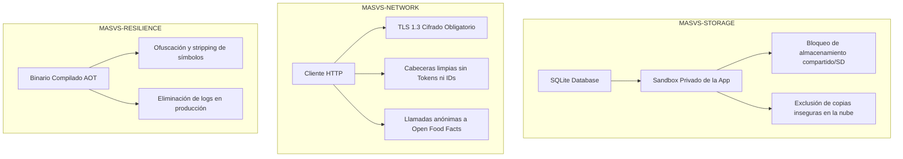

# 06. Seguridad, Privacidad y Cumplimiento Normativo — CestaCuenta

## 1. Principio Rector: Minimización Radical de Datos

CestaCuenta adopta el principio de **Privacidad desde el Diseño y por Defecto** (*Privacy by Design & by Default*) tipificado en el Artículo 25 del RGPD (Reglamento General de Protección de Datos de la Unión Europea).

### 1.1 Cero Información de Identificación Personal (Cero PII)
- La aplicación **no solicita, no captura, no procesa ni almacena** ningún dato que permita identificar directa o indirectamente a la persona física que la utiliza.
- No existen campos para:
  - Nombres y apellidos.
  - Direcciones de correo electrónico.
  - Números de teléfono.
  - Datos bancarios, números de tarjeta o cuentas corrientes.
  - Coordenadas de geolocalización o nombres de comercios vinculados por GPS.

### 1.2 Cero Telemetría y Cero Analítica Comercial
- Queda terminantemente prohibida la inclusión de kits de desarrollo de software (SDK) de seguimiento de terceros:
  - Sin Google Firebase Analytics, sin Facebook SDK, sin AppsFlyer, sin Adjust, sin Mixpanel.
  - Sin identificadores de publicidad para seguimiento entre aplicaciones (`IDFA` en iOS, `AAID / GAID` en Android).
- En caso de errores o fallos en tiempo de ejecución (*crashes*), los registros (*logs*) de depuración se escriben únicamente en el almacenamiento volátil local del dispositivo y jamás se transmiten a servidores externos sin la acción deliberada y manual del usuario al exportar un informe de diagnóstico.

---

## 2. Matriz Estricta de Permisos del Sistema Operativo

CestaCuenta sigue el principio de **privilegio mínimo** a nivel de manifiesto de la aplicación (`AndroidManifest.xml` e `Info.plist`).

### 2.1 Permiso Único Requerido

| Permiso | Plataforma | Justificación de Uso | Impacto si se Rechaza |
| :--- | :--- | :--- | :--- |
| `CAMERA` (`android.permission.CAMERA` / `NSCameraUsageDescription`) | Android / iOS | Permitir el acceso al sensor óptico trasero para la captura y decodificación de códigos de barras de productos en tiempo real. | La aplicación pasa de forma transparente al **"Modo sin cámara"**, permitiendo el registro mediante teclado numérico manual sin bloquear ninguna otra función. |

### 2.2 Permisos Prohibidos y Vetados a Nivel de Manifiesto
Los siguientes permisos están **expresamente prohibidos** y su presencia en los archivos de compilación constituirá un fallo crítico en la integración continua:

- ❌ `ACCESS_FINE_LOCATION` / `ACCESS_COARSE_LOCATION` (Ubicación GPS o por red).
- ❌ `READ_CONTACTS` / `WRITE_CONTACTS` (Libreta de contactos).
- ❌ `READ_EXTERNAL_STORAGE` / `WRITE_EXTERNAL_STORAGE` (Acceso a fotos, archivos o almacenamiento compartido).
- ❌ `RECORD_AUDIO` (Micrófono).
- ❌ `READ_PHONE_STATE` (Estado del teléfono e IMEI).
- ❌ `BLUETOOTH` / `BLUETOOTH_ADMIN` (Balizas de seguimiento en tienda).

---

## 3. Cumplimiento OWASP MASVS (Mobile Application Security Verification Standard)

CestaCuenta se audita frente a los estándares de seguridad para aplicaciones móviles de OWASP (nivel MASVS-L1).



### 3.1 MASVS-STORAGE: Almacenamiento Local Seguro
1. **Confinamiento en Sandbox Privado:**
   - La base de datos SQLite y los archivos de configuración residen exclusivamente en los directorios protegidos por el kernel del sistema operativo:
     - *Android:* `/data/user/0/com.cestacuenta.app/databases/`
     - *iOS:* `/var/mobile/Containers/Data/Application/<UUID>/Library/Application Support/`
   - Los permisos de lectura y escritura del sistema de archivos están restringidos exclusivamente al UID propio de la aplicación.
2. **Exclusión de Backups Inseguros en la Nube:**
   - En Android, se deshabilita la copia automática de seguridad no cifrada en Google Drive mediante `android:allowBackup="false"` o configurando un `backup_rules.xml` restrictivo que excluya la base de datos de precios.
   - En iOS, se establece el atributo `NSURLIsExcludedFromBackupKey` sobre la base de datos local si no se cuenta con cifrado adicional.

### 3.2 MASVS-NETWORK: Seguridad en Comunicaciones de Red
1. **Canal Seguro Forzoso (TLS 1.3 / 1.2):**
   - Prohibido cualquier tráfico en texto plano (`cleartextTrafficPermitted="false"` en Android; `NSAppTransportSecurity` con `NSAllowsArbitraryLoads = false` en iOS).
   - La única conexión de red saliente autorizada es hacia la API pública de Open Food Facts: `https://world.openfoodfacts.org/`.
2. **Peticiones Estrictamente Anónimas:**
   - Las peticiones HTTP salientes para consultar códigos de barras no transmiten identificadores de hardware, cookies de sesión, tokens de autenticación ni direcciones IP persistentes en el cuerpo de la llamada.
   - La cabecera `User-Agent` se limita a un identificador técnico genérico exigido por la política de la API (ej. `CestaCuenta - Android - Version 1.0.0`).

### 3.3 MASVS-CODE & RESILIENCE: Integridad de Ejecución
- Supresión de logs en compilaciones de producción: Todas las llamadas a utilidades de log o consola se desactivan en modo release para evitar fugas de información de la cesta en los registros del sistema (`logcat` o `syslog`).

---

## 4. Arquitectura para Futura Sincronización Opcional (Zero-Knowledge y Cifrado E2E)

Aunque el MVP es 100% local, el diseño prevé la futura incorporación de una función de exportación y sincronización en la nube entre múltiples dispositivos del mismo usuario sin comprometer el principio de privacidad radical.

### 4.1 Principio Zero-Knowledge (Cero Conocimiento)
Si en fases futuras se habilita un servidor de almacenamiento en la nube, este operará como un almacén ciego (*blind storage*): el servidor solo almacena fragmentos de datos cifrados binarios (*blobs*) y carece matemáticamente de las claves necesarias para descifrar la lista de la compra o los importes.

### 4.2 Protocolo Criptográfico de Extremo a Extremo (E2EE)

```text
+---------------------------------------------------------------------------------+
| Dispositivo A (Origen)                                                         |
|  1. Datos en claro: JSON { "session_id": "...", "total_cents": 4380, ... }     |
|  2. Frase de paso o clave secreta del usuario (Password / Passphrase)           |
|  3. Derivación de Clave: Argon2id(Passphrase, Salt) -> Clave Maestra K (256b)  |
|  4. Cifrado Autenticado: XChaCha20-Poly1305(K, Nonce, JSON) -> Criptograma + Tag|
+---------------------------------------------------------------------------------+
                                      |
                                      v (Envío por canal HTTPS seguro)
+---------------------------------------------------------------------------------+
| Servidor / Buzón Intermedio (Zero-Knowledge)                                    |
|  - Almacena únicamente: { id, user_hash, salt, nonce, ciphertext, auth_tag }   |
|  - No puede leer nombres de productos, precios ni totales.                      |
+---------------------------------------------------------------------------------+
                                      |
                                      v (Descarga de blob)
+---------------------------------------------------------------------------------+
| Dispositivo B (Destino)                                                         |
|  1. Introduce la misma Frase de paso del usuario                                |
|  2. Deriva idéntica Clave K mediante Argon2id(Passphrase, Salt)                 |
|  3. Descifrado y Verificación: XChaCha20-Poly1305.open(K, Nonce, Ciphertext)   |
|  4. Inserción atómica en el SQLite local del Dispositivo B                      |
+---------------------------------------------------------------------------------+
```

### 4.3 Especificación del Algoritmo Criptográfico:
- **Función de Derivación de Claves (KDF):** **Argon2id** con parámetros recomendados por RFC 9106 (Memoria: 64 MB, Iteraciones: 3, Paralelismo: 4) para resistencia extrema frente a ataques por fuerza bruta mediante GPU/ASIC.
- **Cifrado Simétrico Autenticado (AEAD):** **XChaCha20-Poly1305** (con nonce extendido aleatorio de 192 bits para eliminar cualquier riesgo de reutilización de nonce) o **AES-256-GCM**.
- **Garantía:** Incluso si la base de datos remota sufre una brecha total de seguridad, la privacidad de los hábitos de consumo y gasto del usuario permanece matemáticamente protegida.
