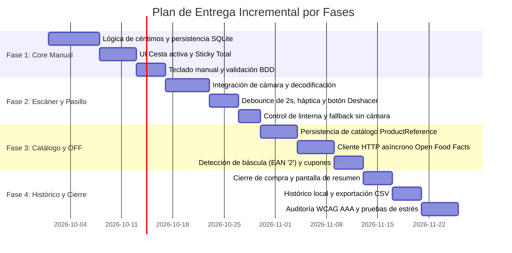

# 07. Plan de Entrega Incremental y Criterios de Calidad — CestaCuenta

## 1. Estrategia de Entrega: Enfoque de Rebanadas Verticales (Vertical Slicing)

El desarrollo de CestaCuenta se estructura en cuatro fases evolutivas estrictamente secuenciales. Cada fase entrega un incremento de software **totalmente funcional, testeable y desplegable** de extremo a extremo (desde la base de datos hasta la interfaz gráfica), minimizando riesgos de integración tardía.

---

## 2. Desglose Detallado de Fases

### Fase 1: Flujo Vertical Manual en Céntimos (Core Financiero y Cesta Básica)
- **Objetivo:** Disponer de una calculadora de cesta 100% funcional sin depender de hardware óptico, validando la integridad del modelo matemático y la persistencia local.
- **Entregables:**
  1. Módulo de lógica de dominio con aritmética financiera en números enteros (`int64` céntimos).
  2. Parser de cadenas monetarias (conversión de formatos `"1,45"`, `"1.4"`, `"5"` a céntimos enteros con exclusión de tipos float/double).
  3. Base de datos SQLite local con tablas `shopping_sessions` y `cart_items` configurada en modo WAL.
  4. Pantalla de cesta activa con lista reactiva de productos y barra persistente inferior (*Sticky Bottom Bar*) mostrando el "Total estimado".
  5. Componente de teclado numérico dedicado in-app para entrada manual rápida de precio y nombre.
  6. Acciones inmediatas de incremento (`+`), decremento (`-`) y borrado de líneas.

---

### Fase 2: Escáner de Cámara y Experiencia en Pasillo
- **Objetivo:** Dotar a la aplicación de su método principal de captura ágil mediante el sensor óptico trasero del teléfono, optimizado para el contexto de compra en supermercado.
- **Entregables:**
  1. Integración del controlador de cámara de bajo nivel con motor nativo de decodificación de códigos de barras 1D (EAN-13, EAN-8, UPC-A, UPC-E).
  2. Mecanismo de debounce por software con ventana de bloqueo temporal de 2000 ms para evitar dobles lecturas involuntarias del mismo artículo.
  3. Retroalimentación háptica (vibración de 100 ms) al decodificar un código válido.
  4. Aviso flotante temporal (*Snackbar*) de adición con botón interactivo de "Deshacer" (disponible durante 4 segundos).
  5. Control integrado para encendido y apagado de la linterna/antorcha del dispositivo.
  6. Manejo elegante de permisos: transición automática y silenciosa al "Modo sin cámara" si el usuario deniega el permiso o el hardware no dispone de cámara.

---

### Fase 3: Catálogo Local Persistente y Fallback Open Food Facts
- **Objetivo:** Eliminar la necesidad de reintroducir nombres y precios para productos consumidos habitualmente, enriqueciendo los datos mediante bases de datos abiertas.
- **Entregables:**
  1. Implementación de la tabla `product_references` para almacenamiento persistente del último precio conocido y nombre asignado a cada código de barras.
  2. Lógica de auto-incremento instantáneo de la cesta al escanear productos ya registrados en el catálogo local.
  3. Cliente HTTP asíncrono para Open Food Facts con timeout agresivo de 1500 ms, para autocompletar el nombre de artículos nuevos sin bloquear la interacción del usuario.
  4. Soporte para productos pesados al granel y detección de códigos de balanza (prefijo EAN '2').
  5. Soporte para descuentos directos en céntimos por línea y líneas de cupones de descuento generales.

---

### Fase 4: Histórico de Compras, Exportación y Refinamiento de Accesibilidad
- **Objetivo:** Cerrar el ciclo de vida de la compra, permitir la consulta de gastos pasados y asegurar el cumplimiento riguroso de accesibilidad y estabilidad.
- **Entregables:**
  1. Flujo de finalización de compra con paso a estado `COMPLETED` y vaciado de cesta para la siguiente sesión.
  2. Pantalla de resumen de compra detallado (artículos, fecha, hora y total a contrastar con el ticket).
  3. Pantalla de histórico de compras con paginación de sesiones anteriores.
  4. Funcionalidad de exportación de la cesta o compra en formato texto plano o CSV para el usuario.
  5. Auditoría de accesibilidad WCAG 2.1 AAA en los componentes de Total Estimado y verificación de navegación completa con VoiceOver / TalkBack.
  6. Pruebas de estrés y estabilidad con listas de más de 200 artículos a 60 fps constantes.

---

## 3. Criterios de Terminado (Definition of Done - DoD) por Fase

Para considerar completada cualquier fase y autorizar el avance a la siguiente, se deben cumplir obligatoriamente los siguientes criterios de calidad:

| Área | Criterio de Terminado (DoD) Obligatorio |
| :--- | :--- |
| **Pruebas Unitarias** | Cobertura de código superior al **90%** en la capa de dominio (`Domain Engine`), cubriendo exhaustivamente todos los casos frontera de parseo monetario y operaciones de sumatorio. |
| **Pruebas de Integración** | Verificación automatizada de migraciones y transacciones de base de datos SQLite (inserción, actualización, borrado en cascada y disparadores de cálculo). |
| **Rendimiento** | Latencia de actualización del Total Estimado inferior a **16 ms** en dispositivo real de gama media. Tiempo de arranque en frío (*cold start*) menor a **800 ms**. |
| **Accesibilidad** | Verificación de ratio de contraste $\ge 7:1$ (WCAG AAA) en Total Estimado y dimensiones mínimas de área táctil de $48 \times 48\text{ dp}$ en todos los botones interactivos. |
| **Resiliencia Offline** | Validación en entorno simulado sin conectividad (modo avión absoluto): 100% de los flujos de la fase deben ejecutarse sin excepciones no controladas ni bloqueos de interfaz. |
| **Seguridad** | Verificación de exclusión total de permisos no autorizados en el manifiesto (`Location`, `Contacts`, etc.) y ausencia de llamadas a librerías de telemetría de terceros. |
| **Revisión de Código** | Código estricto sin advertencias (*zero linter warnings*) bajo el conjunto de reglas estándar del framework, sin variables de tipo flotante en el manejo de moneda. |

---

## 4. Matriz de Trazabilidad entre Requisitos y Fases

| Requisito / Caso Frontera | Fase Asignada | Mecanismo de Verificación |
| :--- | :---: | :--- |
| **RF-02 / Aritmética de céntimos enteros** | Fase 1 | Suite de pruebas unitarias parametrizadas con más de 50 formatos de entrada de precio. |
| **RF-03 / Sticky Total Estimado permanente** | Fase 1 | Prueba de widget con scroll continuo verificando visibilidad constante en pantalla. |
| **RF-04 / RF-05 / Persistencia atómica SQLite** | Fase 1 | Prueba de integración interrumpiendo el ciclo de vida de la app y comprobando restauración. |
| **RF-01 / Escaneo de códigos 1D** | Fase 2 | Pruebas de campo con códigos físicos EAN-13, EAN-8 y UPC bajo diversas condiciones de luz. |
| **Debounce de 2 segundos y Háptica** | Fase 2 | Prueba temporal verificando que fotogramas idénticos en $\Delta t < 2000\text{ ms}$ son descartados. |
| **Modo sin cámara ante permiso denegado** | Fase 2 | Prueba de permisos forzando revocación y validando activación inmediata del modo manual. |
| **RF-06 / Catálogo local ProductReference** | Fase 3 | Prueba de persistencia: escanear código conocido y validar auto-completado de precio en 0 toques. |
| **RF-09 / Artículos al peso (Granel y EAN '2')** | Fase 3 | Pruebas unitarias de detección de prefijo '2' y extracción de céntimos de balanza. |
| **RF-10 / Descuentos por línea y cupones** | Fase 3 | Verificación de reglas matemáticas: el total de la cesta no puede ser inferior a 0 céntimos. |
| **RF-11 / Fallback Open Food Facts** | Fase 3 | Mocking de llamadas HTTP lentas (>1500 ms) verificando que la interfaz no se congela. |
| **RF-12 / Histórico de compras y cierre** | Fase 4 | Prueba de ciclo de vida completo: compra activa -> cierre -> histórico -> nueva compra limpia. |
| **Accesibilidad WCAG 2.1 AAA** | Fase 4 | Auditoría con herramientas de inspección semántica y prueba manual con TalkBack y VoiceOver. |
