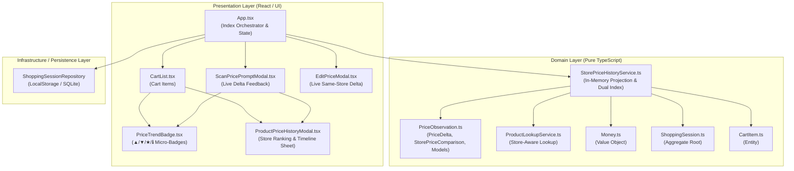
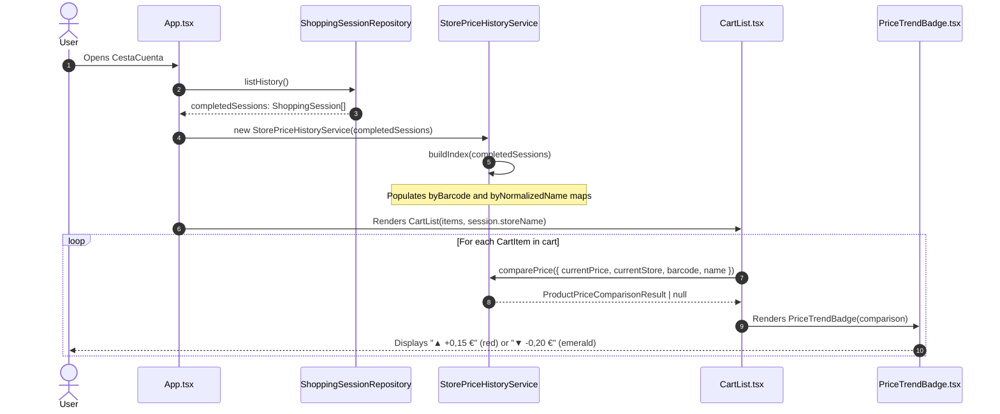
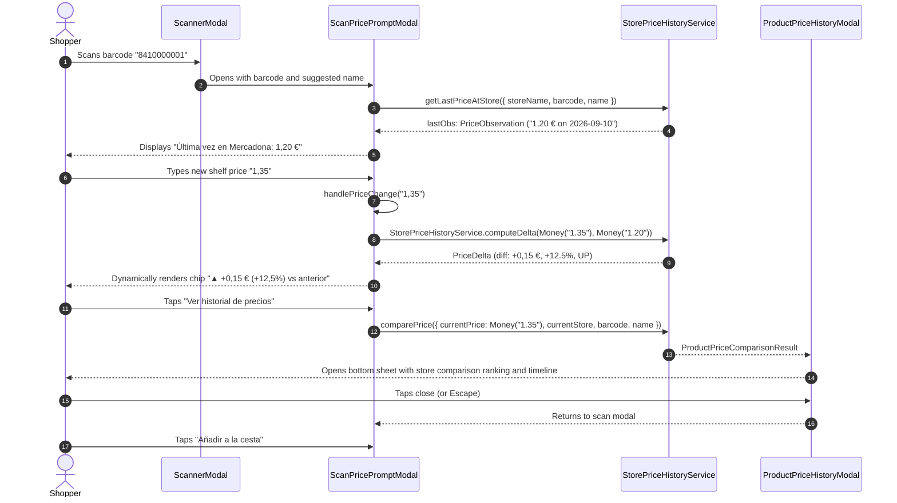
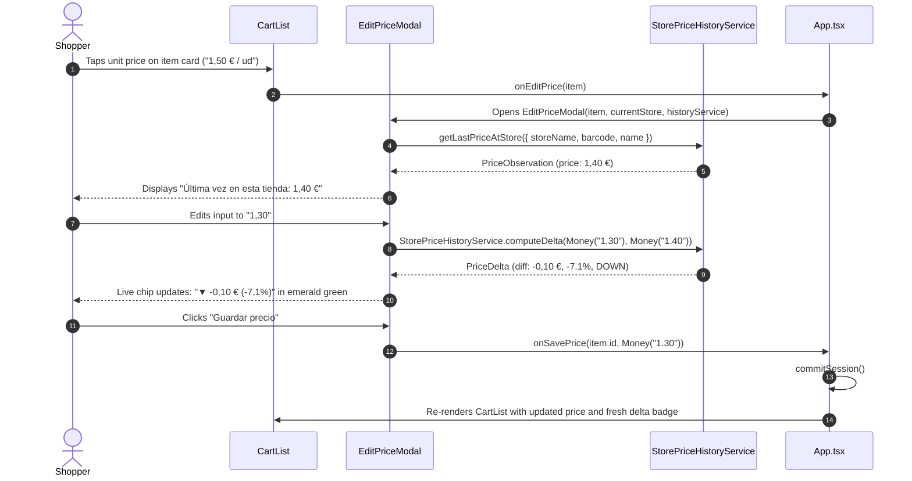
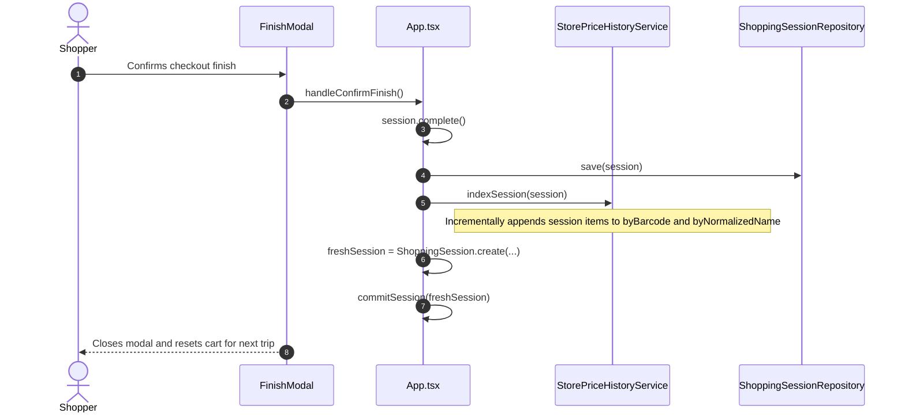

# Design Document: Store Price History (`store-price-history`)

## 1. Context & Problem Statement

Supermarket grocery shoppers navigate volatile price landscapes across supermarket chains (e.g., Mercadona, Carrefour, Lidl, Dia, Alcampo, Eroski). In inflationary environments, shelf prices change frequently, and consumers find it difficult to recall whether a product's current shelf price is higher or lower than what they paid on previous visits, or whether the item is substantially cheaper at a competing store.

In CestaCuenta:
1. **Limited Product Price Memory**: The existing `ProductReference` catalog stores only a single global price per barcode without store affiliation, timestamp, or historical evolution.
2. **Untapped Historical Data**: Completed shopping sessions containing granular line items (`CartItem.unitPrice`, `name`, `barcode`, `discount`, store, and date) are stored in `ShoppingSessionRepository.listHistory()`, but are not projected or indexed for real-time decision-making during an active shopping trip.
3. **In-Store Mobile Ergonomics**: Shoppers navigate supermarket aisles holding a basket or cart in one hand and their phone in the other. Complex navigation or multi-step queries are impractical; price insights must be visible at a glance (micro-badges in cart cards) and provide instant feedback while entering shelf prices (in scanning modals).
4. **Offline and Zero-Backend Constraint**: CestaCuenta operates 100% offline with zero cloud server dependencies and local persistence (LocalStorage on Web, SQLite on Native/Capacitor). Any solution must introduce zero schema migration risks for existing users.
5. **Domain Invariant Rigor**: CestaCuenta's `Money` value object strictly enforces non-negative integers (`cents >= 0`) and throws upon negative subtractions. Historical price differences (which can be negative when a product is cheaper) must be handled safely without violating value object invariants.

This design document establishes the architecture, domain models, indexing service, UI components, and testing strategy for the `store-price-history` capability.

---

## 2. Technical Approach & Architecture

The architecture adheres strictly to Clean Architecture and Domain-Driven Design (DDD). Historical price analysis is implemented as an **in-memory domain projection** derived from canonical completed sessions in `ShoppingSessionRepository.listHistory()`.



### 2.1 Domain Layer
- **`PriceObservation` & Supporting Models (`src/domain/entities/PriceObservation.ts`)**:
  - `PriceObservation`: Strongly typed observation representing a past purchase point (`price: Money`, `date: Date`, `storeName: string`, `sessionId: string`, `productName: string`, `barcode?: string`, `isPromotional: boolean`).
  - `PriceDelta`: Encapsulates signed price variation (`diffCents: number`, `absoluteDiff: Money`, `percentage: number`, `direction: 'UP' | 'DOWN' | 'EQUAL'`, `formattedDiff: string`, `formattedPercent: string`) without violating `Money` invariants.
  - `StorePriceComparison`: Aggregated price point per unique store with difference relative to current store's shelf price (`diffVsCurrent?: PriceDelta`, `isCheapest: boolean`).
  - `ProductPriceComparisonResult`: Comprehensive comparison package containing same-store delta, cross-store best price, potential savings, store-by-store ranking array, and chronological same-store timeline.
  - `ProductPriceHistory`: Raw chronological observations bucketed for a product.
- **`StorePriceHistoryService` (`src/domain/services/StorePriceHistoryService.ts`)**:
  - In-memory domain service initialized with historical sessions from `ShoppingSessionRepository.listHistory()`.
  - Filters strictly for completed sessions (`status === 'COMPLETED'`), ignoring active or discarded sessions.
  - Builds dual hash maps for instantaneous $O(1)$ constant-time lookup:
    1. `byBarcode: Map<string, PriceObservation[]>` keyed by trimmed barcode.
    2. `byNormalizedName: Map<string, PriceObservation[]>` keyed by normalized product name.
  - Normalizes store names (`storeName.trim().toLowerCase()`) to eliminate whitespace and casing discrepancies while preserving the user's latest casing for display.
  - Implements two-tier product matching hierarchy: Exact Barcode (Priority 1) $\rightarrow$ Exact Normalized Name (Priority 2, diacritic-insensitive via `normalizeText`).
  - Implements incremental session indexing (`indexSession(session)`) when active shopping trips complete.
- **`ProductLookupService` (`src/domain/services/ProductLookupService.ts`)**:
  - Extended to accept `currentStore?: string`. When querying a scanned barcode, checks `StorePriceHistoryService.getLastPriceAtStore()` to suggest store-specific historical prices when available.

### 2.2 UI & Presentation Layer
- **`PriceTrendBadge` (`src/ui/components/PriceTrendBadge.tsx`)**:
  - Accessible micro-badge rendered alongside unit prices in `CartList` and modals.
  - Visual variants:
    - **Inflation Alert** (`▲ +0,10 €` / `+8.3%`): Warm red styling (`--danger`).
    - **Savings / Discount** (`▼ -0,15 €` / `-12.0%`): Fresh emerald green styling (`--primary`).
    - **Best Historical Price** (`★ Mejor precio`): Amber/gold styling (`--accent-amber`).
    - **Stable Price** (`= Mismo precio`): Neutral subtle slate styling (`--text-secondary`).
    - **First Time at Store** (`ℹ Primera vez`): Cyan badge (`--accent-cyan`) when product was bought elsewhere but not at the current store.
  - Hidden when product has zero historical purchases across all stores.
  - Accessible: WCAG AA compliant touch target, descriptive Spanish `aria-label`.
- **`ProductPriceHistoryModal` (`src/ui/components/ProductPriceHistoryModal.tsx`)**:
  - Bottom sheet / dialog triggered by tapping any `PriceTrendBadge`.
  - Displays:
    1. **Header**: Product name, barcode, current store name, unit price, and same-store delta.
    2. **Savings Callout**: Highlighted banner when cheaper at another store, indicating store name and potential savings amount.
    3. **Store Comparison Table**: Stores ranked by current store first, then price ascending, showing store name, latest recorded price, relative date, and difference vs current.
    4. **Price Evolution Timeline**: Chronological history of purchases at current store showing date, price, and "Promo aplicada" tag if promotional discount applied.
  - Accessible dismissal: Escape key, backdrop tap, close button, focus trap.
- **Modal Integrations**:
  - **`ScanPricePromptModal`**: Displays previous purchase context at current store (e.g., *"Última vez en Mercadona: 1,15 € el 18 sep"*), renders a dynamic live delta chip as the user types a new price, and displays a best-price notice if cheaper elsewhere.
  - **`EditPriceModal`**: Shows previous purchase price at the current store and updates a live difference chip on every keystroke.
  - **`CartList`**: Renders `PriceTrendBadge` next to unit price and delegates click events to open `ProductPriceHistoryModal`.
- **`App.tsx` Orchestration**:
  - Instantiates `StorePriceHistoryService` in a React state/memo.
  - Hydrates the service index on startup from `repository.listHistory()`.
  - Incrementally updates the index via `storePriceHistoryService.indexSession(session)` inside `handleConfirmFinish`.
  - Manages modal visibility and selection state for `ProductPriceHistoryModal`.

---

## 3. Architecture Decisions (ADR)

### ADR 1: In-Memory Projection Index vs Persistent Secondary Database Table
- **Context**: Querying historical prices requires grouping thousands of items across dozens of past shopping sessions by product and store.
- **Choice**: Derive all price observations in-memory using `StorePriceHistoryService` populated at application startup from `ShoppingSessionRepository.listHistory()`.
- **Alternatives Considered**:
  - *Secondary SQLite table / LocalStorage key (`store_product_prices`)*: Rejected because maintaining a secondary denormalized store introduces data sync risks (if a session is deleted, cleared, or modified), requires schema migration scripts for existing mobile/web installations, and increases persistence complexity.
  - *On-Demand Querying on Render*: Iterating through all sessions in React render loops or `useEffect` would introduce severe UI stutter and frame drops.
- **Rationale**: An in-memory projection from canonical session history guarantees zero schema migrations, works identically on Web and SQLite, cannot drift from canonical session data, consumes minimal memory (< 200 KB for 4,000 items), and delivers instantaneous sub-millisecond ($O(1)$) lookups during user typing and cart scrolling.

### ADR 2: Strict Barcode & Normalized Name Matching Hierarchy vs Fuzzy Token Matching
- **Context**: Products in shopping carts may be added via barcode scan, catalog selection, or manual entry. Items must be correctly matched to historical records without false associations.
- **Choice**: Implement a strict two-tier matching hierarchy:
  1. Exact Barcode Match (Priority 1): 100% guarantee of identical product.
  2. Exact Normalized Name Match (Priority 2): Strips accents/diacritics (`normalizeText`), converts to lower case, removes non-alphanumeric characters, and collapses whitespace.
  3. No match $\implies$ return `null`.
- **Alternatives Considered**:
  - *Fuzzy Substring / Word-Subset Matcher* (such as the one used in `ShoppingListMatcherService`): Rejected for price history because grocery variants have identical brand names but different fat contents or sizes (e.g. *"Leche Pascual Entera 1L"* vs *"Leche Pascual Desnatada 1L"*, or *"Tomate Frito 400g"* vs *"Tomate Triturado 800g"*). Generating false inflation alerts from mismatched product variants would severely undermine user trust.
- **Rationale**: Strict normalized matching ensures that price comparisons and inflation alerts are only shown when there is high certainty of product identity.

### ADR 3: Signed `PriceDelta` Contract Preserving Strict Non-Negative `Money` Invariants
- **Context**: CestaCuenta's `Money` value object (`src/domain/value-objects/Money.ts`) strictly forbids negative cents (`cents >= 0`) and throws an error if `subtract()` would yield a negative value. However, grocery prices can decrease (discounts, deflation), requiring negative differences.
- **Choice**: Model price changes through a dedicated `PriceDelta` domain contract where:
  - `diffCents: number` holds the raw signed integer difference ($P_{curr} - P_{prev}$).
  - `absoluteDiff: Money` holds `Money.fromCents(Math.abs(diffCents))` for safe arithmetic and formatted rendering.
  - `direction: TrendDirection` explicitly records `'UP'`, `'DOWN'`, or `'EQUAL'`.
  - `formattedDiff: string` produces localized Spanish signed representations (`"+0,15 €"`, `"-0,30 €"`, `"0,00 €"`).
  - `percentage: number` and `formattedPercent: string` provide signed relative change rounded to 1 decimal place.
- **Alternatives Considered**:
  - *Allowing negative values in `Money`*: Rejected because it would break existing domain invariants across the entire app (e.g. cart subtotals, session totals, discounts).
  - *Returning plain numbers*: Rejected because formatted currency presentation requires consistent localization (`1,50 €` with comma decimal separator).
- **Rationale**: Preserves domain integrity while cleanly satisfying UI presentation requirements.

### ADR 4: Store Name Grouping with Display Casing Preservation
- **Context**: Users may type store names with varying casing or spacing across trips (e.g. `"Mercadona"`, `"mercadona"`, `"Mercadona "`, or leave it blank).
- **Choice**: Group stores in the index using a normalized store key (`storeName.trim().toLowerCase()`), with a fallback to `"Supermercado"` if blank. Maintain the most recently observed formatted store name for display in the UI.
- **Alternatives Considered**:
  - *Forcing strict casing*: Would split `"Mercadona"` and `"mercadona"` into separate store comparison rows.
  - *Hardcoding known supermarket names*: Fragile and limits user flexibility across independent grocers, local markets, or regional chains.
- **Rationale**: Provides forgiving user input handling while maintaining attractive, natural casing in UI tables.

### ADR 5: Incremental Session Indexing on Completion vs Full Re-Index
- **Context**: When a user completes a shopping session (`handleConfirmFinish`), the newly finished items should immediately be available for future price comparisons.
- **Choice**: Expose `StorePriceHistoryService.indexSession(session: ShoppingSession)` to append new observations directly into existing in-memory maps upon session completion.
- **Alternatives Considered**:
  - *Calling `buildIndex(await repository.listHistory())`*: Re-reads and re-parses all past sessions from storage. While functional, it is wasteful on mobile devices with large histories.
- **Rationale**: Incremental indexing runs in $< 1 \text{ ms}$ for typical session sizes (20-40 items), immediately updating state with zero asynchronous delay.

### ADR 6: Multi-Stage Visual Presentation (Micro-Badge $\rightarrow$ Detailed Modal Sheet $\rightarrow$ Live Input Feedback)
- **Context**: In-store shoppers need immediate, non-disruptive feedback while also having the option to explore full comparison details when making purchasing trade-offs.
- **Choice**: Three-stage UI presentation:
  1. *Micro-Badge (`PriceTrendBadge`)*: Compact chip in cart rows showing directional icon and delta (`▲ +0,10 €` / `▼ -0,15 €` / `★ Mejor precio`).
  2. *Detail Sheet (`ProductPriceHistoryModal`)*: Opened upon tapping the micro-badge, showing full store rankings, potential savings, and chronological price timeline.
  3. *Live Dynamic Feedback*: Inline chips in `ScanPricePromptModal` and `EditPriceModal` that calculate and update deltas on every keystroke.
- **Alternatives Considered**:
  - *Expanding cart rows inline*: Clutters cart view and pushes other cart items off-screen.
  - *Static text without icons*: Fails accessibility guidelines for color-blind users.
- **Rationale**: Balances glanceability with deep analytical access while adhering to WCAG AA mobile guidelines.

---

## 4. Data Flow & Interaction Diagrams

### 4.1 Startup Hydration & Cart Item Evaluation



### 4.2 Scanning a Barcode with Live Dynamic Feedback & Price History Modal



### 4.3 Editing Unit Price in Cart with Live Delta



### 4.4 Completing Session and Incremental Index Update



---

## 5. Detailed Interfaces & Contracts

### 5.1 Domain Layer: `PriceObservation.ts`

```typescript
// src/domain/entities/PriceObservation.ts
import { Money } from '../value-objects/Money.js';

export type TrendDirection = 'UP' | 'DOWN' | 'EQUAL';

export interface PriceObservation {
  readonly price: Money;
  readonly date: Date;
  readonly storeName: string;
  readonly sessionId: string;
  readonly productName: string;
  readonly barcode?: string;
  readonly isPromotional: boolean;
}

export interface PriceDelta {
  readonly diffCents: number;            // Signed difference in cents (e.g., +15, -30, 0)
  readonly absoluteDiff: Money;          // Non-negative Money instance for safe rendering
  readonly percentage: number;           // Rounded to 1 decimal place (e.g., 15.0, -12.5, 0.0)
  readonly direction: TrendDirection;    // 'UP' | 'DOWN' | 'EQUAL'
  readonly formattedDiff: string;        // Localized string e.g., "+0,15 €", "-0,30 €", "0,00 €"
  readonly formattedPercent: string;     // Localized string e.g., "+15,0 %", "-12,5 %", "0,0 %"
}

export interface StorePriceComparison {
  readonly storeName: string;
  readonly isCurrentStore: boolean;
  readonly latestPrice: Money;
  readonly latestDate: Date;
  readonly diffVsCurrent?: PriceDelta;   // Difference relative to current store's shelf price
  readonly isCheapest: boolean;
}

export interface ProductPriceComparisonResult {
  readonly productName: string;
  readonly barcode?: string;
  readonly currentStore: string;
  readonly currentPrice: Money;
  readonly sameStoreDelta: PriceDelta | null; // null if first purchase at current store
  readonly bestHistoricalObservation: PriceObservation;
  readonly isCurrentBest: boolean;
  readonly potentialSavings: Money;      // Money.zero() if isCurrentBest is true
  readonly storeComparisons: StorePriceComparison[];
  readonly sameStoreObservations: PriceObservation[]; // Chronological list at current store
}

export interface ProductPriceHistory {
  readonly observations: PriceObservation[];
  readonly latestObservation: PriceObservation;
  readonly bestObservation: PriceObservation;
}
```

### 5.2 Domain Layer: `StorePriceHistoryService.ts`

```typescript
// src/domain/services/StorePriceHistoryService.ts
import { Money } from '../value-objects/Money.js';
import { ShoppingSession } from '../entities/ShoppingSession.js';
import {
  PriceObservation,
  PriceDelta,
  ProductPriceComparisonResult,
  ProductPriceHistory,
} from '../entities/PriceObservation.js';

export interface ComparePriceParams {
  currentPrice: Money;
  currentStore?: string;
  barcode?: string;
  name: string;
}

export interface QueryHistoryParams {
  barcode?: string;
  name: string;
}

export interface StorePriceHistoryServiceContract {
  buildIndex(sessions: ShoppingSession[]): void;
  indexSession(session: ShoppingSession): void;
  getHistory(params: QueryHistoryParams): ProductPriceHistory | null;
  comparePrice(params: ComparePriceParams): ProductPriceComparisonResult | null;
  getLastPriceAtStore(params: { storeName?: string; barcode?: string; name: string }): PriceObservation | null;
  getBestPrice(params: QueryHistoryParams): PriceObservation | null;
}
```

Implementation logic details:
- **`normalizeStoreName(name?: string): string`**:
  - `name?.trim().toLowerCase() || 'supermercado'`
- **`computeDelta(current: Money, previous: Money): PriceDelta`**:
  - `diffCents = current.cents - previous.cents`
  - `percentage = previous.cents === 0 ? 0 : Math.round((diffCents / previous.cents) * 1000) / 10`
  - `direction = diffCents > 0 ? 'UP' : diffCents < 0 ? 'DOWN' : 'EQUAL'`
  - `formattedDiff = direction === 'UP' ? `+${Money.fromCents(diffCents).toFormattedString()}` : direction === 'DOWN' ? `-${Money.fromCents(-diffCents).toFormattedString()}` : '0,00 €'`
  - `formattedPercent = direction === 'UP' ? `+${percentage.toFixed(1).replace('.', ',')} %` : direction === 'DOWN' ? `${percentage.toFixed(1).replace('.', ',')} %` : '0,0 %'`
  - `absoluteDiff = Money.fromCents(Math.abs(diffCents))`

### 5.3 UI Layer: Component Props Contracts

#### `PriceTrendBadge.tsx`
```typescript
import { ProductPriceComparisonResult } from '../../domain/entities/PriceObservation.js';

export interface PriceTrendBadgeProps {
  readonly comparison: ProductPriceComparisonResult | null;
  readonly onClick?: () => void;
  readonly className?: string;
  readonly compact?: boolean;
}
```

#### `ProductPriceHistoryModal.tsx`
```typescript
import { ProductPriceComparisonResult } from '../../domain/entities/PriceObservation.js';

export interface ProductPriceHistoryModalProps {
  readonly isOpen: boolean;
  readonly comparison: ProductPriceComparisonResult | null;
  readonly onClose: () => void;
}
```

#### Updated Component Props:
- **`CartListProps`**:
  ```typescript
  export interface CartListProps {
    items: CartItem[];
    currentStore?: string;
    priceHistoryService?: StorePriceHistoryService;
    onIncrementQuantity: (itemId: string) => void;
    onDecrementQuantity: (itemId: string) => void;
    onDeleteItem: (itemId: string) => void;
    onEditPrice: (item: CartItem) => void;
    onViewPriceHistory?: (comparison: ProductPriceComparisonResult) => void;
  }
  ```
- **`ScanPricePromptModalProps`**:
  ```typescript
  export interface ScanPricePromptModalProps {
    isOpen: boolean;
    barcode: string;
    initialName?: string;
    initialPrice?: Money;
    isScale?: boolean;
    source?: ProductLookupSource;
    currentStore?: string;
    priceHistoryService?: StorePriceHistoryService;
    onClose: () => void;
    onConfirm: (name: string, price: Money, isBulk: boolean) => void;
    onViewPriceHistory?: (comparison: ProductPriceComparisonResult) => void;
  }
  ```
- **`EditPriceModalProps`**:
  ```typescript
  export interface EditPriceModalProps {
    isOpen: boolean;
    item: CartItem | null;
    currentStore?: string;
    priceHistoryService?: StorePriceHistoryService;
    onClose: () => void;
    onSavePrice: (itemId: string, newPrice: Money) => void;
  }
  ```

---

## 6. File Changes & Project Structure

| File Path | Action | Description |
| :--- | :--- | :--- |
| `src/domain/entities/PriceObservation.ts` | **Create** | Pure domain types and contracts: `PriceObservation`, `TrendDirection`, `PriceDelta`, `StorePriceComparison`, `ProductPriceComparisonResult`, and `ProductPriceHistory`. |
| `src/domain/services/StorePriceHistoryService.ts` | **Create** | Pure domain service for in-memory indexing, dual-map lookup, delta calculation, store ranking, and incremental updates. |
| `src/domain/services/ProductLookupService.ts` | **Modify** | Accept `currentStore?: string` and optional `priceHistoryService` to suggest store-specific shelf prices. |
| `src/domain/index.ts` | **Modify** | Export new entities, interfaces, and service. |
| `src/ui/components/PriceTrendBadge.tsx` | **Create** | Visual trend badge component with colored chips (`▲`, `▼`, `=`, `★`, `ℹ`), touch target, and accessible labels. |
| `src/ui/components/ProductPriceHistoryModal.tsx` | **Create** | Bottom sheet dialog showing current store delta, savings banner, store comparison table, and price evolution timeline. |
| `src/ui/components/CartList.tsx` | **Modify** | Integrate `PriceTrendBadge` in item header row and emit `onViewPriceHistory` when badge is tapped. |
| `src/ui/components/ScanPricePromptModal.tsx` | **Modify** | Render previous store price banner, dynamic live delta chip, and cross-store best price alert. |
| `src/ui/components/EditPriceModal.tsx` | **Modify** | Show previous purchase at current store and dynamic live difference indicator as user edits price. |
| `src/ui/App.tsx` | **Modify** | Initialize `StorePriceHistoryService`, hydrate on mount from `repository.listHistory()`, update on session completion (`handleConfirmFinish`), and coordinate history modal state. |
| `src/ui/styles.css` | **Modify** | CSS styles for `PriceTrendBadge` color variants, dynamic difference chips, store comparison tables, and modal sheet animations. |
| `tests/domain/StorePriceHistoryService.test.ts` | **Create** | Unit test suite for indexing, lookup hierarchy, deltas, all-time best price, ranking, and edge cases. |
| `tests/ui/PriceTrendBadge.test.tsx` | **Create** | Component tests for badge variants, colors, and accessibility attributes using `renderToString`. |
| `tests/ui/ProductPriceHistoryModal.test.tsx` | **Create** | Component tests for ranking table, timeline, savings callout, and accessibility using `renderToString`. |
| `tests/ui/CartList.test.tsx` | **Create** | Tests verifying `CartList` renders badges when history is present and triggers modal handler on click. |
| `tests/ui/ScanPricePromptModal.test.tsx` | **Create** | Tests verifying historical banner and live delta calculations in scanner modal. |

---

## 7. Testing Strategy

### 7.1 Domain Service Tests (`StorePriceHistoryService.test.ts`)
- **Indexing & Source Filtering**:
  - Indexes only `COMPLETED` sessions; skips `ACTIVE` and `DISCARDED` sessions.
  - Sorts observations chronologically descending within barcode and normalized name buckets.
  - Correctly extracts `isPromotional` flag when item discount > 0.
- **Incremental Indexing (`indexSession`)**:
  - Newly completed session is appended directly without calling repository.
  - Immediately visible in subsequent lookups.
- **Matching Hierarchy**:
  - Barcode match returns immediately ($O(1)$).
  - Items without barcode resolve via normalized name (strips diacritics, case-insensitive, punctuation removed).
  - Unmatched products return `null`.
- **Store Name Normalization**:
  - `"Mercadona"`, `"mercadona "`, `"MERCADONA"` resolve to the same store bucket.
  - Blank/undefined store names normalize to `"Supermercado"`.
  - Display casing preserves the latest user entry.
- **Delta & Trend Calculations**:
  - Price increase $\implies$ `direction: 'UP'`, positive signed cents, `+X,XX €`, `+X,X %`.
  - Price drop $\implies$ `direction: 'DOWN'`, negative signed cents, `-X,XX €`, `-X,X %`, positive `absoluteDiff`.
  - Identical price $\implies$ `direction: 'EQUAL'`, zero cents, `0,00 €`, `0,0 %`.
  - First-time purchase at store $\implies$ `sameStoreDelta: null`.
- **Cross-Store Comparison & Best Price**:
  - Correctly identifies minimum price across all stores.
  - Computes `potentialSavings` when current price is higher than historical best.
  - Sorts store comparison list: current store first, then remaining stores ascending by price.

### 7.2 UI Component Tests (`PriceTrendBadge.test.tsx`)
- Renders `null` when comparison is `null` or when zero historical data exists.
- Renders warm red pill with `▲ +0,10 €` when trend is `'UP'`.
- Renders emerald green pill with `▼ -0,15 €` when trend is `'DOWN'`.
- Renders amber pill with `★ Mejor precio` when `isCurrentBest` is true and trend is `'EQUAL'` or null.
- Renders neutral pill with `= Mismo precio` when trend is `'EQUAL'`.
- Renders cyan pill with `ℹ Primera vez` on first visit to store with history elsewhere.
- Verifies descriptive Spanish `aria-label` is present on interactive element.
- Verifies minimum touch target size (48px) styling.

### 7.3 UI Component Tests (`ProductPriceHistoryModal.test.tsx`)
- Renders `null` when `isOpen === false` or `comparison === null`.
- Renders product name, current store, and current price in header.
- Renders savings callout banner when `potentialSavings.cents > 0`.
- Renders store comparison ranking table with columns for store, price, date, and delta.
- Renders chronological timeline of purchases at current store, showing "Promo aplicada" tag for promotional items.
- Dismisses on close button click and supports accessible backdrop tap.

### 7.4 Integration & Regression Tests
- **`CartList.test.tsx`**: Verifies cart rows render badges beside unit price when `priceHistoryService` returns comparison data.
- **`ScanPricePromptModal.test.tsx`**: Verifies previous purchase context banner renders when barcode has history, and dynamic live difference chip updates when user types in the price field.
- **Existing Suite Regression**: All 26 existing test suites continue to pass with 0 regressions.

---

## 8. Threat Matrix & Security Analysis

| Threat / Risk | Severity | Mitigation Strategy |
| :--- | :--- | :--- |
| **Data Privacy & Price Exposure** | Low | All price observations and session histories are stored strictly locally on the user's device (`localStorage` / SQLite). No pricing data, supermarket names, or cart contents are ever transmitted over the network. |
| **Memory Exhaustion with Large Histories** | Low | Observations store only primitive values and `Money` references. 5,000 observations consume under 250 KB of RAM. Double maps store references to the same observation objects. |
| **XSS via Malicious Store or Product Names** | Medium | All store names, product names, and formatted amounts are rendered via standard React JSX text nodes (`<span>{storeName}</span>`), which automatically escape HTML entities. No `dangerouslySetInnerHTML` is used. |
| **False Inflation Alerts (Product Variant Confusion)** | Medium | Exact normalized name matching and exact barcode matching are strictly enforced. Fuzzy token matching is explicitly rejected for price history, preventing confusion between whole/skimmed milk or different product weights. |
| **Negative Money Value Exception Crash** | High | `PriceDelta` isolates signed integer arithmetic (`diffCents: number`) from non-negative `Money` formatting (`absoluteDiff = Money.fromCents(Math.abs(diffCents))`). Negative values are never passed to `Money.fromCents()`, completely eliminating runtime invariant crashes. |

---

## 9. Migration & Rollback Strategy

### Migration Plan
- **Zero Database Schema Migrations**: No new tables are created in SQLite, and no new root keys are added to `localStorage`. `StorePriceHistoryService` is a pure in-memory projection derived from existing `ShoppingSessionRepository.listHistory()` data.
- **Backward Compatibility**: Existing sessions recorded in previous versions of CestaCuenta are automatically indexed on startup without conversion or data upgrade scripts.
- **Cold Start Compatibility**: For new users or newly added items with no historical records, the service returns `null` and UI badges cleanly suppress themselves, maintaining a clean initial experience.

### Rollback Plan
- The change is strictly additive. In the event of a rollback:
  1. Reverting the code commit removes `StorePriceHistoryService`, `PriceObservation`, and the UI components.
  2. The canonical session history in SQLite and `localStorage` remains 100% intact with zero data loss or corrupted state.
  3. No database down-migrations or storage clearing steps are required.

---

## 10. Open Questions & Future Considerations

1. **Unit Price per Kilogram / Liter Normalization**:
   - Currently, comparison evaluates item shelf `unitPrice`. For items sold by weight or bulk, comparing price per kilogram across packages of different net weights (e.g. 500g vs 1kg) would be valuable in a future enhancement once package net weight metadata is standardized.
2. **Auto-Suggestions for Store Names in Header**:
   - `StorePriceHistoryService` maintains a list of unique visited store names. Exposing `getVisitedStores(): string[]` can power an auto-complete dropdown in `Header.tsx` to help users enter consistent store names effortlessly.
3. **Receipt OCR Historical Import**:
   - In future phases, users could scan historical paper receipts with the camera OCR engine to populate past store prices in bulk without having actively used the app during those past trips.
