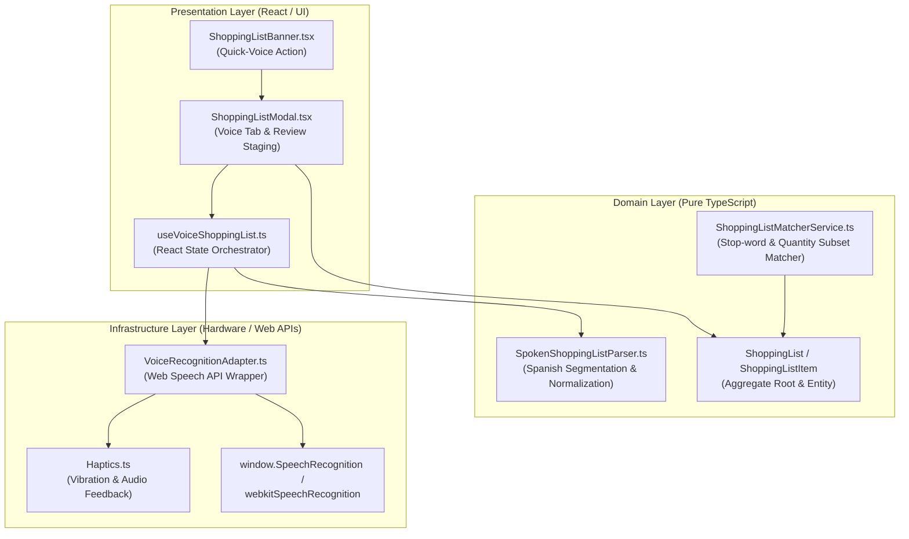
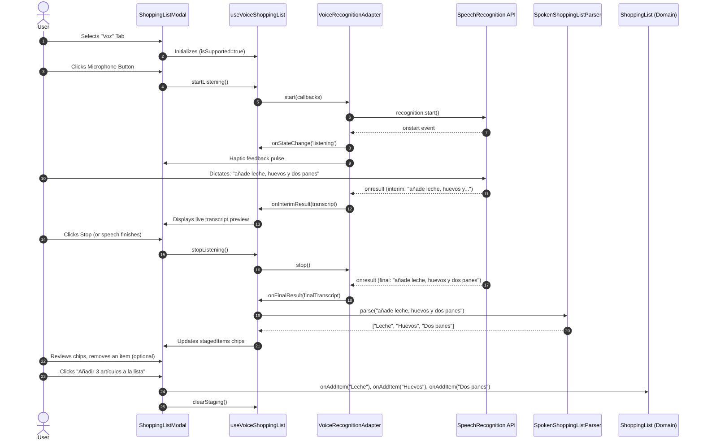
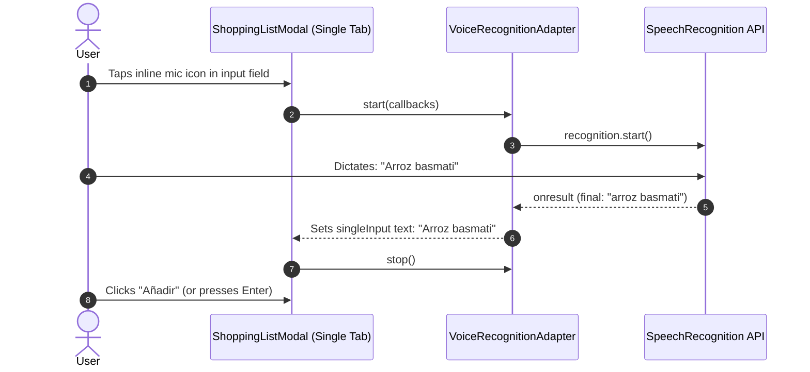
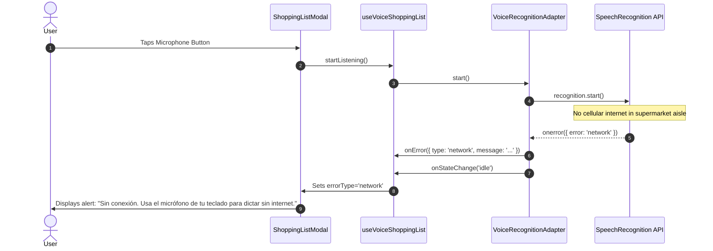

# Design Document: Voice Shopping List (`voice-shopping-list`)

## 1. Context & Problem Statement

Populating a shopping list in a grocery store application often occurs when the user's hands are busy (e.g., checking refrigerator shelves at home or navigating aisles in a supermarket). In CestaCuenta, the shopping list feature currently requires manual keyboard typing item-by-item or pasting multiline text.

Introducing natural spoken Spanish voice dictation allows users to quickly add items either one-by-one or in bulk (e.g., *"leche, huevos, tres plátanos y pan"*). However, voice input in grocery shopping environments faces distinct engineering challenges:
1. **Supermarket Noise & Ambient Chatter**: Dictation in public spaces can easily pick up background noise, nearby conversations, or store PA announcements, resulting in garbled or erroneous entries.
2. **Spanish Grammar & Natural Phrasing**: Users speak using natural connectors (*" y "*, *" e "* before *i/hi*, *" además de "*), conversational prefixes (*"por favor añade a la lista"*, *"comprar"*), and quantities (*"dos paquetes de arroz"*, *"3 litros de leche"*). At the same time, compound grocery items (*"jamón y queso"*, *"sal y pimienta"*, *"aceite de oliva"*) contain connectors that must not be split naively.
3. **Supermarket Connectivity Realities**: Supermarket basements and store aisles frequently experience weak or zero cellular coverage. Standard browser Web Speech API implementations (like Chrome on Android or Desktop) rely on cloud speech services and fail with `error: 'network'` if offline, whereas on-device models or mobile keyboard dictation operate offline.
4. **Platform & Browser Disparities**: iOS Safari requires synchronous user gesture activation for microphone capture; Firefox lacks Web Speech API by default; Brave blocks Google's speech recognition endpoint.
5. **Quantity Matching in Cart**: An item dictated as *"2 leches"* or *"dos leches"* must still automatically match and cross off when the user scans *"Leche Pascual Entera 1L"* into their cart.

This design document establishes the architecture, domain contracts, hardware abstraction, UI staging flow, and testing strategy for `voice-shopping-list`.

---

## 2. Technical Approach & Architecture

Adhering strictly to Clean Architecture and Domain-Driven Design (DDD) principles, the solution isolates browser hardware interactions from domain business logic and presentation state.



### 2.1 Domain Layer
- **`SpokenShoppingListParser`**: A pure domain service without external or DOM dependencies.
  - Implements natural language segmentation for Spanish speech:
    - Splits by punctuation (commas, periods, semicolons, line breaks).
    - Splits by Spanish conjunctions: `" y "` (space-bounded) and `" e "` (space-bounded before words starting with `i-` or `hi-`).
    - Splits by multi-word connectors: `" además de "`, `" y también "`, `" también "`.
  - Strips leading intent prefixes (e.g., *"añade a la lista"*, *"añadir"*, *"pon en la lista"*, *"apunta"*, *"comprar"*, *"quiero comprar"*, *"por favor"*).
  - Preserves recognized compound food expressions (e.g., *"jamón y queso"*, *"sal y pimienta"*, *"fresas con nata"*) and prepositional compounds (*"aceite de oliva"*, *"leche de avena"*).
  - Preserves quantities, numbers, and measurement units (e.g., *"2 paquetes de arroz"*, *"medio kilo de manzanas"*, *"tres litros de leche"*).
  - Normalizes casing (first letter capitalized) and strips redundant whitespace.
- **`ShoppingListMatcherService`**:
  - Enriches `SPANISH_STOP_WORDS` with digits (`0` to `9`) and common Spanish number words (`dos`, `tres`, `cuatro`, `cinco`, `seis`, `siete`, `ocho`, `nueve`, `diez`, `medio`, `kilo`, `litro`, `litros`, `paquete`, `paquetes`).
  - Ensures that when a user dictates *"2 leches"* or *"dos leches"*, the significant word extracted is `"leche"`, matching scanned cart items like *"Leche Pascual Entera 1L"*.

### 2.2 Infrastructure Layer
- **`VoiceRecognitionAdapter`**:
  - Implements `IVoiceRecognitionAdapter`. Encapsulates `window.SpeechRecognition` or `window.webkitSpeechRecognition`.
  - Feature-detects API availability safely for Node/SSR environments (`typeof window !== 'undefined'`).
  - Manages recognition configuration: `lang = 'es-ES'`, `interimResults = true`, `continuous = true`.
  - Translates native speech recognition events (`start`, `speechstart`, `result`, `speechend`, `error`, `end`) into a deterministic finite state machine (`idle` $\rightarrow$ `starting` $\rightarrow$ `listening` $\rightarrow$ `stopping` $\rightarrow$ `idle` or `error`).
  - Standardizes error codes into typed domain errors: `'not-allowed'`, `'network'`, `'no-speech'`, `'audio-capture'`, `'not-supported'`, `'aborted'`, `'unknown'`.
  - Employs `Haptics` to trigger subtle sensory pulses upon listening start and finish.

### 2.3 Presentation / UI Layer
- **`useVoiceShoppingList` Hook**:
  - Orchestrates the `VoiceRecognitionAdapter` lifecycle within the React component lifecycle.
  - Maintains reactive state: `isSupported`, `state`, `isListening`, `interimTranscript`, `stagedItems`, `errorMessage`, `errorType`.
  - Provides handlers: `startListening()`, `stopListening()`, `removeStagedItem(index)`, `updateStagedItem(index, name)`, `commitStagedItems(onAddItem)`, `clearStaging()`, `clearError()`.
  - Automatically parses finalized speech transcripts using `SpokenShoppingListParser` and appends newly parsed items into the review staging queue.
- **`ShoppingListModal` UI Updates**:
  - **Tabs Bar**: Introduces a 3rd tab: "Voz" (`mode === 'voice'`), alongside "Añadir uno a uno" and "Pegar texto".
  - **Voice Dictation Tab**:
    - Central animated microphone button reflecting current state (idle, listening wave pulse, processing).
    - Live interim transcription display box with `aria-live="polite"`.
    - Interactive staging preview area showing parsed items as individual chips with remove (`✕`) buttons.
    - Editable transcript box allowing users to tweak or re-parse text if needed.
    - Confirmation action button: *"Añadir X artículos a la lista"*, active only when staged items exist.
    - Fallback card for unsupported browsers (Firefox/Brave) or network errors, recommending phone keyboard dictation.
  - **Single Mode Inline Mic**:
    - Compact inline microphone button embedded inside the text input of the "Añadir uno a uno" tab for rapid single-item dictation.
- **`ShoppingListBanner`**:
  - Displays quick voice indicator/button to open the modal directly in voice mode.

---

## 3. Architecture Decisions (ADR)

### ADR 1: Staged Review Area vs. Immediate Auto-Add
- **Context**: In a busy supermarket, ambient conversations or misrecognized words could immediately pollute the user's persistent shopping list if recognized text were instantly saved to storage.
- **Choice**: Introduce a review staging area where recognized speech is parsed into removable chips before saving.
- **Alternatives Considered**:
  - *Direct Insertion*: Automatically insert items as soon as speech pauses. Rejected because undoing or deleting multiple misrecognized items in a noisy store creates severe frustration.
- **Rationale**: The staging area allows the user to glance at the parsed result, tap `✕` to remove an unwanted split or false sound, and commit with a single confident tap (*"Añadir 3 artículos"*).

### ADR 2: Decoupled Infrastructure Adapter (`VoiceRecognitionAdapter`) vs Direct Hook Integration
- **Context**: Web Speech API is browser-dependent, non-standardized across engines (`webkitSpeechRecognition` vs `SpeechRecognition`), and throws browser-specific error strings.
- **Choice**: Encapsulate all Web Speech API operations inside `VoiceRecognitionAdapter` in `src/infrastructure/device/` adhering to an `IVoiceRecognitionAdapter` interface.
- **Alternatives Considered**:
  - *Calling `new webkitSpeechRecognition()` directly inside React hooks or components*: Creates high coupling, breaks Vitest/SSR tests, and scatters browser quirk handling across UI files.
- **Rationale**: Isolating the device API behind an adapter ensures 100% testability with unit mocks, clean error normalization, and clean separation between device mechanics and UI state.

### ADR 3: Pure Rule-Based Domain Parser vs Remote NLP / LLM Cloud API
- **Context**: Segmenting Spanish spoken text like *"leche, huevos, tres plátanos y pan"* into individual items requires separating connectors, stripping prefixes, and preserving quantities.
- **Choice**: Build a deterministic pure TypeScript parser (`SpokenShoppingListParser`) using regex and vocabulary sets for Spanish conjunctions and food compound protections.
- **Alternatives Considered**:
  - *Cloud LLM / NLP API*: Rejected because it requires network access (failing in supermarket dead zones), adds latency (500ms-2000ms), requires API keys/cost, and introduces privacy concerns for user voice data.
- **Rationale**: The rule-based parser executes instantaneously (<1ms), operates 100% offline, has zero dependency overhead, and yields deterministic, testable behavior.

### ADR 4: Stop-Word Expansion in `ShoppingListMatcherService`
- **Context**: A user dictating *"dos leches"* or *"2 leches"* creates a list item named `"2 leches"`. When the user scans a carton of milk (*"Leche Pascual Entera 1L"*), the matcher needs to recognize that the item has been picked up.
- **Choice**: Add Spanish number words (`dos`, `tres`, `cuatro`, etc.) and numeric digits (`0-9`) to `SPANISH_STOP_WORDS` in `ShoppingListMatcherService`.
- **Alternatives Considered**:
  - *Stripping quantities during parsing*: Discarding quantities would lose useful shopping info (the user wants to remember they need *two* cartons, not just one).
- **Rationale**: Preserving the quantity in the list item name provides the best user clarity, while treating numbers as stop-words in the cart matcher ensures automated cross-off still functions flawlessly.

### ADR 5: Mobile Keyboard Dictation Fallback for Offline & Supermarket Realities
- **Context**: Chrome on Android and Windows relies on Google cloud speech servers. In store aisles without internet, Web Speech API throws `error: 'network'`.
- **Choice**: Trap `'network'` errors and render actionable fallback instructions guiding the user to tap the microphone key built directly into their mobile keyboard (iOS Dictation / Gboard), which runs on-device offline models directly into standard inputs.
- **Alternatives Considered**:
  - *Bundling a WASM on-device speech model (e.g. Whisper.tflite)*: Rejected due to bundle size (>40MB download), high RAM consumption on low-end mobile devices, and extreme implementation complexity for an MVP.
- **Rationale**: Leveraging the operating system's native keyboard dictation provides a reliable, zero-byte offline fallback.

---

## 4. Data Flow & Interaction Diagrams

### 4.1 Multi-Item Dictation with Staging and Commit



### 4.2 Single-Item Inline Dictation



### 4.3 Network Failure / Supermarket Offline Handling



---

## 5. Detailed Interfaces & Contracts

### 5.1 Domain Layer: `SpokenShoppingListParser`

```typescript
// src/domain/services/SpokenShoppingListParser.ts

export interface SpokenParserOptions {
  stripPrefixes?: boolean;
  protectCompounds?: boolean;
  preserveQuantities?: boolean;
}

export class SpokenShoppingListParser {
  /**
   * Established compound grocery items containing "y", "e", or "con" that should NOT be segmented.
   */
  private static readonly PROTECTED_COMPOUNDS: string[] = [
    'jamon y queso',
    'jamón y queso',
    'sal y pimienta',
    'fresas con nata',
    'frutas y verduras',
    'pan y chocolate',
    'cafe con leche',
    'café con leche',
  ];

  /**
   * Prepositional connectors that must be kept with their parent word (e.g. "aceite de oliva").
   */
  private static readonly PREPOSITIONAL_CONNECTORS = /\b(de|con|sin|al|del)\b/i;

  /**
   * Natural conversational command prefixes to strip.
   */
  private static readonly COMMAND_PREFIXES: RegExp[] = [
    /^(?:por favor\s+)?(?:añade|añadir|agrega|agregar|pon|poner|apunta|apuntar)\s+(?:a\s+la\s+lista\s+(?:de\s+la\s+compra\s+)?|en\s+la\s+lista\s+)?/i,
    /^(?:quiero|necesito|voy a)\s+(?:comprar|añadir|apuntar)\s+/i,
    /^(?:comprar|compra)\s+/i,
    /^(?:por favor\s+)/i,
  ];

  /**
   * Spanish conjunctions and connector splitters:
   * - commas, semicolons, periods, newlines
   * - " además de ", " y también ", " también "
   * - " y " (space-separated)
   * - " e " (space-separated before i/hi)
   */
  private static readonly SPLIT_REGEX = /(?:[,\.;\n]+|\s+además\s+de\s+|\s+y\s+también\s+|\s+también\s+|\s+y\s+|\s+e\s+(?=[ií]|h[ií]))/i;

  /**
   * Parses natural spoken Spanish text into discrete shopping list items.
   */
  public static parse(spokenText: string, options?: SpokenParserOptions): string[] {
    if (!spokenText || typeof spokenText !== 'string' || !spokenText.trim()) {
      return [];
    }

    const opts: Required<SpokenParserOptions> = {
      stripPrefixes: options?.stripPrefixes ?? true,
      protectCompounds: options?.protectCompounds ?? true,
      preserveQuantities: options?.preserveQuantities ?? true,
    };

    let text = spokenText.trim();

    // 1. Strip leading command prefixes from initial text
    if (opts.stripPrefixes) {
      text = this.stripLeadingPrefixes(text);
    }

    if (!text) return [];

    // 2. Protect compound words with placeholders
    const compoundPlaceholders: Map<string, string> = new Map();
    if (opts.protectCompounds) {
      text = this.maskCompounds(text, compoundPlaceholders);
    }

    // 3. Segment by conjunctions and punctuation
    const rawTokens = text.split(this.SPLIT_REGEX);

    // 4. Clean tokens, restore compounds, strip per-item clause prefixes, format
    const result: string[] = [];
    for (const rawToken of rawTokens) {
      let token = rawToken.trim();
      if (!token) continue;

      // Unmask compound placeholders
      for (const [placeholder, original] of compoundPlaceholders.entries()) {
        token = token.replace(placeholder, original);
      }

      // Strip intra-clause command prefixes (e.g. "... y comprar cafe")
      if (opts.stripPrefixes) {
        token = this.stripClausePrefixes(token);
      }

      // Clean punctuation
      token = token.replace(/^[-*•\s]+/, '').replace(/[,.;]+$/, '').trim();

      if (token.length > 0) {
        // Sentence case capitalization
        const formatted = token.charAt(0).toUpperCase() + token.slice(1);
        result.push(formatted);
      }
    }

    return result;
  }

  private static stripLeadingPrefixes(text: string): string {
    let cleaned = text;
    for (const regex of this.COMMAND_PREFIXES) {
      cleaned = cleaned.replace(regex, '');
    }
    return cleaned.trim();
  }

  private static stripClausePrefixes(text: string): string {
    return text.replace(/^(?:comprar|compra|añadir|añade|traer|coger)\s+/i, '').trim();
  }

  private static maskCompounds(text: string, map: Map<string, string>): string {
    let masked = text;
    this.PROTECTED_COMPOUNDS.forEach((compound, idx) => {
      const regex = new RegExp(`\\b${compound}\\b`, 'gi');
      if (regex.test(masked)) {
        const placeholder = `__COMPOUND_${idx}__`;
        map.set(placeholder, compound);
        masked = masked.replace(regex, placeholder);
      }
    });
    return masked;
  }
}
```

### 5.2 Infrastructure Layer: `VoiceRecognitionAdapter`

```typescript
// src/infrastructure/device/VoiceRecognitionAdapter.ts

export type VoiceRecognitionState = 'idle' | 'starting' | 'listening' | 'stopping' | 'error';

export type VoiceRecognitionErrorType =
  | 'not-allowed'
  | 'network'
  | 'no-speech'
  | 'audio-capture'
  | 'not-supported'
  | 'aborted'
  | 'unknown';

export interface VoiceRecognitionError {
  type: VoiceRecognitionErrorType;
  message: string;
  originalError?: unknown;
}

export interface VoiceRecognitionCallbacks {
  onStateChange: (state: VoiceRecognitionState) => void;
  onInterimResult: (transcript: string) => void;
  onFinalResult: (transcript: string) => void;
  onError: (error: VoiceRecognitionError) => void;
}

export interface IVoiceRecognitionAdapter {
  isSupported(): boolean;
  getState(): VoiceRecognitionState;
  start(callbacks: VoiceRecognitionCallbacks): void;
  stop(): void;
  abort(): void;
}
```

### 5.3 UI Layer: `useVoiceShoppingList` Hook

```typescript
// src/ui/hooks/useVoiceShoppingList.ts

export interface UseVoiceShoppingListOptions {
  onAutoParse?: (items: string[]) => void;
}

export interface UseVoiceShoppingListReturn {
  isSupported: boolean;
  state: VoiceRecognitionState;
  isListening: boolean;
  interimTranscript: string;
  stagedItems: string[];
  errorMessage: string | null;
  errorType: VoiceRecognitionErrorType | null;
  startListening: () => void;
  stopListening: () => void;
  removeStagedItem: (index: number) => void;
  updateStagedItem: (index: number, newName: string) => void;
  addStagedItem: (name: string) => void;
  clearStaging: () => void;
  commitStagedItems: (onCommit: (itemName: string) => void) => void;
  clearError: () => void;
}
```

---

## 6. File Changes & Project Structure

| File Path | Action | Description |
| :--- | :--- | :--- |
| `src/domain/services/SpokenShoppingListParser.ts` | **Create** | Pure domain service for parsing Spanish spoken phrases into shopping list items. |
| `src/domain/services/ShoppingListMatcherService.ts` | **Modify** | Enrich `SPANISH_STOP_WORDS` with digits (`0-9`) and Spanish numerals (`dos`, `tres`, `cuatro`, etc.). |
| `src/domain/index.ts` | **Modify** | Export `SpokenShoppingListParser` and its option types. |
| `src/infrastructure/device/VoiceRecognitionAdapter.ts` | **Create** | Hardware wrapper for `SpeechRecognition` / `webkitSpeechRecognition`, state machine, error handling, haptics. |
| `src/infrastructure/device/Haptics.ts` | **Modify** | Add `triggerVoiceCue()` or subtle vibration helper for voice listening start/stop. |
| `src/ui/hooks/useVoiceShoppingList.ts` | **Create** | Custom React hook managing recognition lifecycle, staging state, and parser orchestration. |
| `src/ui/components/ShoppingListModal.tsx` | **Modify** | Add "Voz" tab, microphone button, interim transcript view, interactive review staging chips, raw edit box, inline mic in single mode. |
| `src/ui/components/ShoppingListBanner.tsx` | **Modify** | Add quick-voice shortcut icon. |
| `src/ui/styles.css` | **Modify** | Add styles for mic pulsing, audio waveforms, staging chips, and error banners. |
| `tests/domain/SpokenShoppingListParser.test.ts` | **Create** | Complete unit test suite for Spanish voice parsing rules and edge cases. |
| `tests/domain/ShoppingListMatcherService.test.ts` | **Modify** | Add test cases verifying dictated quantity items (`"2 leches"`) match scanned products (`"Leche Pascual"`). |
| `tests/infrastructure/device/VoiceRecognitionAdapter.test.ts` | **Create** | Unit tests mocking `SpeechRecognition` to test states, errors, and event lifecycles. |
| `tests/ui/ShoppingListModal.test.tsx` | **Modify** | Add component tests for voice tab rendering, tabs switching, and staging chip interactions. |

---

## 7. Testing Strategy

### 7.1 Domain Tests (`SpokenShoppingListParser.test.ts`)
- **Single items**: `"plátanos"` $\rightarrow$ `["Plátanos"]`.
- **Conjunctions & Connectors**:
  - Punctuation: `"leche, huevos, pan"` $\rightarrow$ `["Leche", "Huevos", "Pan"]`.
  - Conjunction `" y "`: `"leche y huevos y pan"` $\rightarrow$ `["Leche", "Huevos", "Pan"]`.
  - Conjunction `" e "` before `i/hi`: `"café e infusiones e higos"` $\rightarrow$ `["Café", "Infusiones", "Higos"]`.
  - Multi-word connectors: `"arroz además de tomates también galletas"` $\rightarrow$ `["Arroz", "Tomates", "Galletas"]`.
- **Prefix stripping**:
  - `"por favor añade a la lista dos paquetes de café"` $\rightarrow$ `["Dos paquetes de café"]`.
  - `"quiero comprar patatas y comprar pimientos"` $\rightarrow$ `["Patatas", "Pimientos"]`.
  - `"apunta en la lista manzanas"` $\rightarrow$ `["Manzanas"]`.
- **Compound protection**:
  - `"jamón y queso, aceite de oliva y sal y pimienta"` $\rightarrow$ `["Jamón y queso", "Aceite de oliva", "Sal y pimienta"]`.
- **Quantities & Units**:
  - `"2 botes de tomate, 3 kilos de patatas y medio melón"` $\rightarrow$ `["2 botes de tomate", "3 kilos de patatas", "Medio melón"]`.
- **Edge cases**: Empty strings, nulls, whitespace-only, repeated punctuation, capitalization consistency.

### 7.2 Domain Cart Matching Tests (`ShoppingListMatcherService.test.ts`)
- Item `"2 leches"` matches scanned `"Leche Pascual Entera 1L"`.
- Item `"dos paquetes de arroz"` matches scanned `"Arroz SOS Redondo 1kg"`.
- Item `"3 manzanas fuji"` matches scanned `"Manzana Fuji Bolsa 1.5kg"`.

### 7.3 Infrastructure Tests (`VoiceRecognitionAdapter.test.ts`)
- Mocks global `window.SpeechRecognition` and `window.webkitSpeechRecognition`.
- Verifies state transitions: `idle` $\rightarrow$ `starting` $\rightarrow$ `listening` $\rightarrow$ `stopping` $\rightarrow$ `idle`.
- Verifies configuration parameters: `lang === 'es-ES'`, `interimResults === true`.
- Verifies error categorization:
  - `error: 'not-allowed'` translates to `VoiceRecognitionErrorType === 'not-allowed'`.
  - `error: 'network'` translates to `VoiceRecognitionErrorType === 'network'`.
  - `error: 'no-speech'` cleanly resets to `idle`.
- Verifies SSR safety: returns `isSupported() === false` when `window` is undefined.

### 7.4 UI & Component Tests (`ShoppingListModal.test.tsx`)
- Renders the 3 tab options: "Añadir uno a uno", "Pegar texto", "Voz".
- In voice tab with `isSupported = false`, renders the fallback card explaining browser limitations and offering the keyboard dictation hint.
- In voice tab with `isSupported = true`, renders the microphone button in idle state.
- Staged chips render with delete buttons; clicking `✕` removes the chip from the list.
- Confirmation button reflects count: `"Añadir 3 artículos a la lista"` and is disabled when count is 0.

---

## 8. Threat Matrix & Security Analysis

| Threat / Risk | Severity | Mitigation Strategy |
| :--- | :--- | :--- |
| **Microphone Permission Denied or Revoked** | Medium | Handle `'not-allowed'` gracefully; transition adapter to `idle`; render non-intrusive alert with instructions on browser permission settings. Never crash or freeze UI. |
| **Eavesdropping / Continuous Recording Leak** | High | Dictation is strictly scoped to the active modal session. Closing the modal (`onClose`) or unmounting the component immediately calls `adapter.abort()`. No audio stream is maintained in the background. |
| **Privacy / Cloud Voice Data Leak** | Medium | The app uses standard browser Web Speech API with no custom backend audio proxy. No audio recordings or audio blobs are stored locally or uploaded to third-party analytics. |
| **Script Injection / XSS via Spoken Text** | Low | Transcribed strings are parsed as pure plain text tokens and rendered through React JSX escaping (`<span>{item}</span>`), preventing any HTML/XSS injection. |
| **Supermarket Offline Network Failure** | Medium | Catch `error: 'network'` immediately; reset listening state; display clear message suggesting native mobile keyboard dictation. |

---

## 9. Migration & Rollback Strategy

### Migration Plan
- **Zero Schema Migrations**: The persistent `ShoppingList` data model and localStorage keys remain completely untouched. Voice input is strictly an input modality feeding into the existing `onAddItem(name)` pipeline.
- **Rollout**: Instantaneous upon deployment. Feature detection ensures unsupported browsers automatically see the fallback interface without breaking existing manual or paste input modes.

### Rollback Plan
- The changes are strictly additive. If an unexpected regression occurs in production:
  1. Revert the commit branch containing `voice-shopping-list`.
  2. The existing `single` and `paste` tabs continue functioning with 100% backward compatibility.
  3. No database rollbacks, migrations, or local storage clearing required.

---

## 10. Open Questions & Future Considerations

1. **Continuous Mode vs Single Phrase on Mobile**:
   - Some mobile browsers terminate continuous Web Speech sessions after ~10 seconds of silence. The adapter listens for `speechend` and `end` events to automatically flush interim text to final parsed items without requiring manual stop.
2. **User Vocabulary Customization**:
   - In future iterations, users could flag custom compound foods (e.g. regional specialty items) to be remembered by the parser.
