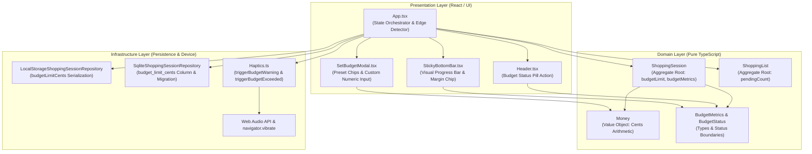
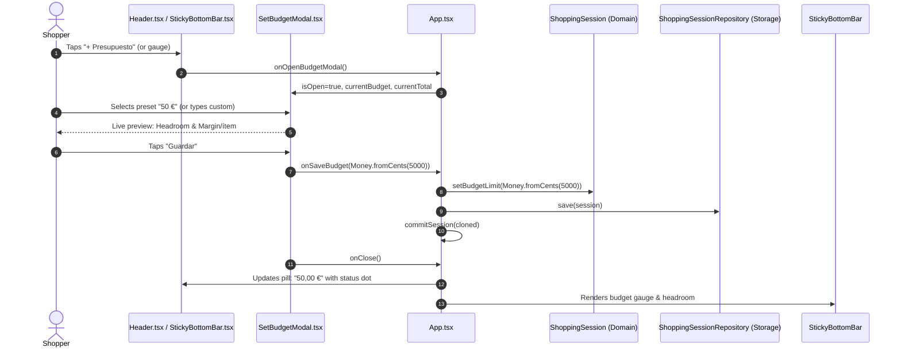
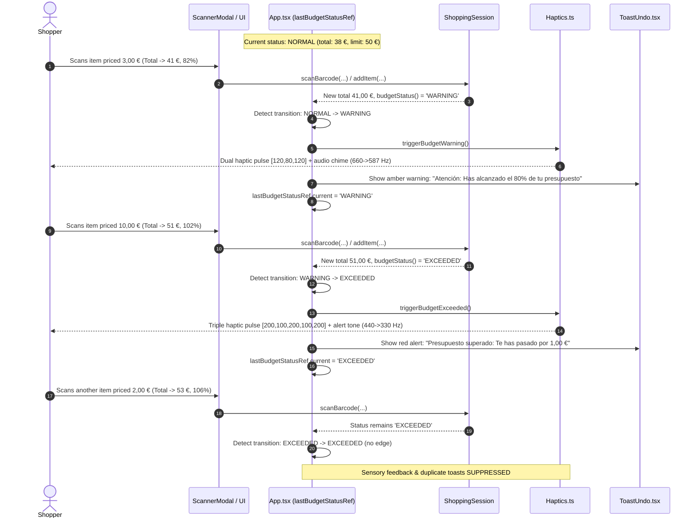
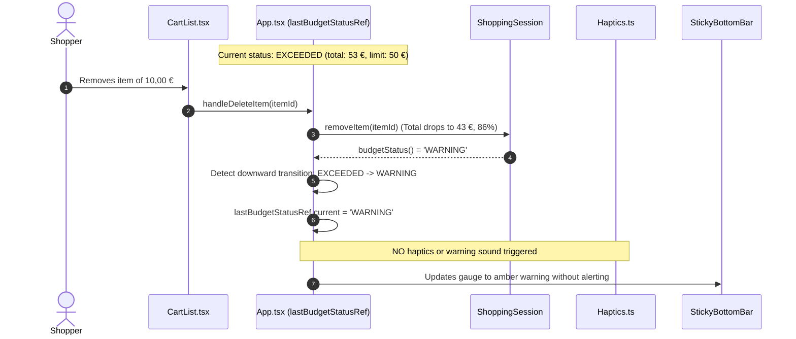

# Design Document: Live Budget Control (`live-budget-control`)

## 1. Context & Problem Statement

Grocery shoppers frequently enter supermarkets with a target budget in mind (e.g. 30 €, 50 €, or 100 €). However, keeping track of mental math while navigating aisles, comparing prices, and handling physical items is mentally exhausting and prone to calculation error. Without live financial guardrails, shoppers experience "checkout surprise"—discovering at the cash register that their cart total significantly exceeds what they intended to spend.

In CestaCuenta, shopping sessions currently calculate running totals, unit prices, discounts, and shopping list progress, but lack explicit spending limits. Adding real-time budget limit management addresses this core shopping friction:
1. **Financial Headroom & Over-Budget Transparency**: Shoppers need an immediate view of how much money remains (`remaining`) or by how much they have exceeded their budget (`overBudget`).
2. **Pacing via Pending Item Margins**: When working off a shopping list, knowing that 20 € remains is helpful, but knowing that 20 € across 5 unchecked items leaves `~4,00 €/ítem` provides direct guidance on purchase pacing.
3. **Sensory Boundary Awareness Without Fatigue**: Shoppers cannot constantly stare at their phone screen. Subtle sensory cues (haptic vibrations and audio tones) when reaching 80% (`WARNING`) and 100% (`EXCEEDED`) keep shoppers informed, but alerts must be edge-triggered so repeated additions do not spam the user.
4. **Strict Domain Money Invariants**: In CestaCuenta, the `Money` value object enforces non-negative integer cents (`cents >= 0`) and throws an error if `subtract()` produces a negative amount. Headroom and deficit math must be mathematically defensive and never attempt negative subtraction.
5. **Zero-Downtime Data Migration**: Existing active and historical shopping sessions stored in Web `localStorage` and SQLite must continue working seamlessly without schema breaks or data loss.

---

## 2. Technical Approach & Architecture

Adhering strictly to Domain-Driven Design (DDD) and Clean Architecture principles, the implementation isolates domain arithmetic from device hardware capabilities and UI rendering.



### 2.1 Domain Layer
- **`ShoppingSession` (Aggregate Root)**:
  - Holds optional spending limit `budgetLimit?: Money`.
  - Enforces active session invariants: `setBudgetLimit(limit)` requires `ensureActive()`.
  - Validates budget amount: `limit.cents > 0` (or `null`/`undefined` to clear).
  - Computes `budgetStatus(): BudgetStatus` (`'NONE'`, `'NORMAL'`, `'WARNING'`, `'EXCEEDED'`).
  - Computes `budgetMetrics(pendingItemCount?: number): BudgetMetrics | null`.
  - Preserves loose coupling: receives scalar `pendingItemCount?: number` rather than referencing `ShoppingList`.
- **`ShoppingList` (Aggregate Root)**:
  - Exposes `pendingCount(): number` to return the number of unchecked items (`this._items.filter(item => !item.isChecked).length`).
- **Defensive Financial Arithmetic**:
  - Compares raw integer cents before subtracting.
  - Headroom: when `total.cents <= budgetLimit.cents`, `remaining = budgetLimit.subtract(total)`; otherwise `Money.zero()`.
  - Deficit: when `total.cents > budgetLimit.cents`, `overBudget = total.subtract(budgetLimit)`; otherwise `Money.zero()`.
  - Integer floor division for pending item margins: `Math.floor(remaining.cents / pendingItemCount)`.

### 2.2 Infrastructure Layer
- **`LocalStorageShoppingSessionRepository`**:
  - `SerializedShoppingSession` includes optional `budgetLimitCents?: number | null`.
  - Deserializer safely hydrates `Money.fromCents(data.budgetLimitCents)` when numeric and `> 0`, defaulting to `undefined` for legacy sessions.
- **`SqliteShoppingSessionRepository`**:
  - Schema includes nullable `budget_limit_cents INTEGER`.
  - Database initialization runs an idempotent `ALTER TABLE shopping_sessions ADD COLUMN budget_limit_cents INTEGER` inside a try/catch block.
  - Statements (`upsertSession`, `selectActiveSession`, `selectSessionById`, `selectHistory`) and `hydrateSession` map `budget_limit_cents`.
- **`Haptics`**:
  - `triggerBudgetWarning()`: Double vibration pulse `[120, 80, 120]` and dual-tone attention audio chime (660 Hz $\rightarrow$ 587 Hz).
  - `triggerBudgetExceeded()`: Urgent triple vibration pulse `[200, 100, 200, 100, 200]` and dual-tone alert chime (440 Hz $\rightarrow$ 330 Hz).
  - Defensive error handling to run safely in headless Vitest tests, SSR, and non-supported mobile browsers.

### 2.3 Presentation / UI Layer
- **`App.tsx` (Edge Detector Orchestrator)**:
  - Tracks previous status with `lastBudgetStatusRef = useRef<BudgetStatus>('NONE')`.
  - Triggers sensory feedback and toasts strictly on upward boundary crossings (`< WARNING` $\rightarrow$ `WARNING`, `< EXCEEDED` $\rightarrow$ `EXCEEDED`).
  - Downward transitions (item deletion, quantity decrease, budget increase) update `lastBudgetStatusRef` silently without alarms.
  - Maintains `isBudgetModalOpen` state and passes callbacks to `Header`, `StickyBottomBar`, and `SetBudgetModal`.
- **`SetBudgetModal.tsx`**:
  - Preset quick-tap chips (`20 €`, `30 €`, `50 €`, `75 €`, `100 €`) meeting 48px touch targets.
  - Formatted decimal input supporting `,` and `.` separators.
  - Live preview calculating current total, prospective headroom/deficit, and pending item margin.
  - Actions: "Guardar", "Eliminar presupuesto" (when set), and "Cancelar".
- **`StickyBottomBar.tsx`**:
  - Mounts `.budget-gauge` bar directly above the cart total card when budget is active.
  - Accessible ARIA attributes (`role="progressbar"`, `aria-valuenow`, `aria-valuemin`, `aria-valuemax`, `aria-label`).
  - Color-coded progress bar (green `<80%`, amber `80%-100%`, red `>100%`).
  - Headroom readout and margin chip (`~X,XX €/ítem`).
  - Tap opens `SetBudgetModal`.
- **`Header.tsx`**:
  - Interactive budget pill action button showing `+ Presupuesto` (when empty) or budget cap with colored status dot.
  - Tap opens `SetBudgetModal`.

---

## 3. Architecture Decisions (ADR)

### ADR 1: Budget Limit Encapsulation in `ShoppingSession` Aggregate Root
- **Context**: A budget limit could either be stored as an application-level UI preference, an external configuration service, or an intrinsic property of the active shopping session.
- **Choice**: Encapsulate `budgetLimit?: Money` directly within the `ShoppingSession` aggregate root.
- **Alternatives Considered**:
  - *External React State / LocalStorage setting*: Rejected because past sessions would lose the context of what budget was active during that shopping trip, and domain services would lack access to session boundaries.
  - *Separate `BudgetPlan` Aggregate Root*: Over-engineering for a single monetary threshold tied 1-to-1 to a session lifetime.
- **Rationale**: A spending budget is inherently scoped to a specific shopping trip. Placing it on `ShoppingSession` ensures consistent persistence, historical retention, and encapsulation of business invariants (e.g. cannot modify budget on completed sessions).

### ADR 2: Defensive Financial Headroom & Deficit Arithmetic (Preventing Negative Cents)
- **Context**: CestaCuenta's `Money` value object enforces non-negative integer cents (`cents >= 0`). Invoking `budgetLimit.subtract(total)` when `total.cents > budgetLimit.cents` throws an unhandled exception that would crash the UI.
- **Choice**: Explicitly branch on raw integer cents before invoking `subtract()`:
  - If `total.cents <= budgetLimit.cents`: `remaining = budgetLimit.subtract(total)`, `overBudget = Money.zero()`.
  - If `total.cents > budgetLimit.cents`: `remaining = Money.zero()`, `overBudget = total.subtract(budgetLimit)`.
- **Alternatives Considered**:
  - *Modifying `Money` to allow negative values*: Rejected because non-negative money is a core invariant of the entire codebase (e.g. item prices, line totals, discounts).
  - *Wrapping `subtract` in try/catch*: Inefficient and obscures intended business logic.
- **Rationale**: Branching by comparing cents is computationally trivial, 100% safe, adheres to domain rules, and completely eliminates runtime subtraction exceptions.

### ADR 3: Edge-Triggered Sensory Feedback via App-Level Transition Detector
- **Context**: When a shopper reaches 80% or exceeds their budget, they need immediate sensory awareness (haptics and audio). However, scanning 5 more items while already over budget should not vibrate and beep 5 times in a row, causing extreme notification fatigue.
- **Choice**: Implement an edge-triggered state transition detector using a React ref (`lastBudgetStatusRef`) in `App.tsx`. Sensory cues fire strictly on upward transitions:
  - `< WARNING` $\rightarrow$ `WARNING`
  - `< EXCEEDED` $\rightarrow$ `EXCEEDED`
  Downward transitions update the reference silently.
- **Alternatives Considered**:
  - *Level-triggered alerts in `commitSession`*: Fired on every save if status is `WARNING` or `EXCEEDED`. Rejected due to notification spam.
  - *Domain-level event emitter*: Overly complex for a client-side PWA where sensory feedback is an infrastructure/device concern.
- **Rationale**: A React ref maintains transition history across renders without causing unnecessary re-renders. Upward-only firing ensures the user is alerted exactly once per threshold breach.

### ADR 4: Loose Aggregate Coupling for Pending Item Margin Projection
- **Context**: Projecting spending margin per pending item requires the unchecked count from `ShoppingList`. Directly coupling `ShoppingSession` to `ShoppingList` violates DDD aggregate boundary rules.
- **Choice**: `ShoppingList` provides `pendingCount(): number`. `ShoppingSession.budgetMetrics(pendingItemCount?: number)` receives this primitive count as an optional parameter.
- **Alternatives Considered**:
  - *Passing `ShoppingList` instance into `ShoppingSession`*: Breaches aggregate isolation.
  - *Domain Service `BudgetProjectionService`*: Unnecessary boilerplate for a single scalar arithmetic division.
- **Rationale**: Passing a scalar number keeps `ShoppingSession` pure, self-contained, and easily testable without instantiating list aggregates.

### ADR 5: Dual-Touchpoint Ergonomic UI (`StickyBottomBar` + `Header` + `SetBudgetModal`)
- **Context**: Shoppers hold phones with one hand while navigating supermarket aisles. Controls must be reachable and clear at a glance.
- **Choice**:
  1. Primary gauge mounted in `StickyBottomBar` directly above the total, accessible to thumbs.
  2. Secondary status pill in `Header` offering quick glance and configuration.
  3. Single dedicated `SetBudgetModal` bottom sheet with quick preset chips (`20 €`, `30 €`, `50 €`, `75 €`, `100 €`) and custom entry.
- **Alternatives Considered**:
  - *Inline editing in Header only*: Hard to tap with one hand on modern large mobile screens.
  - *Modal on every checkout*: Annoying friction for shoppers who prefer shopping without a budget.
- **Rationale**: Combining a bottom-bar visual gauge with quick presets delivers maximum one-handed ergonomics while keeping budget entirely optional.

### ADR 6: Backward-Compatible SQLite Schema Evolution & LocalStorage DTO Hydration
- **Context**: Existing users have active databases and localStorage entries lacking budget fields. Updating the app must not drop tables, lose cart items, or crash on null values.
- **Choice**:
  1. In `SqliteShoppingSessionRepository.initDatabase()`, execute `ALTER TABLE shopping_sessions ADD COLUMN budget_limit_cents INTEGER` inside a try/catch block.
  2. In `LocalStorageShoppingSessionRepository.deserializeSession()`, check `typeof data.budgetLimitCents === 'number' && data.budgetLimitCents > 0`, defaulting safely to `undefined`.
- **Alternatives Considered**:
  - *Database versioning migration framework*: Heavyweight dependency not present in the current stack.
  - *Re-creating tables*: Causes catastrophic data loss of active carts.
- **Rationale**: An idempotent `ALTER TABLE` combined with optional DTO properties provides robust, zero-downtime backward compatibility without external migration dependencies.

---

## 4. Data Flow & Interaction Diagrams

### 4.1 Budget Configuration & Recalculation Flow



### 4.2 Upward Threshold Crossing (Edge-Triggered Warning & Exceeded Sensory Cue)



### 4.3 Downward Silent Recalibration (Item Deletion or Budget Extension)



---

## 5. Detailed Interfaces & Contracts

### 5.1 Domain Layer: `BudgetStatus` & `BudgetMetrics`

```typescript
// src/domain/entities/ShoppingSession.ts

export type BudgetStatus = 'NONE' | 'NORMAL' | 'WARNING' | 'EXCEEDED';

export interface BudgetMetrics {
  limit: Money;
  total: Money;
  remaining: Money;
  overBudget: Money;
  percentage: number;
  status: BudgetStatus;
  marginPerPendingItem: Money | null;
}

export interface ShoppingSessionProps {
  id?: string;
  startedAt?: Date;
  endedAt?: Date;
  status?: SessionStatus;
  storeName?: string;
  items?: CartItem[];
  budgetLimit?: Money;
}

export class ShoppingSession {
  readonly id: string;
  readonly startedAt: Date;
  endedAt?: Date;
  status: SessionStatus;
  storeName?: string;
  private _items: CartItem[];
  private _budgetLimit?: Money;

  constructor(props?: ShoppingSessionProps) {
    // ...existing assignments
    this._budgetLimit = props?.budgetLimit;
  }

  get budgetLimit(): Money | undefined {
    return this._budgetLimit;
  }

  setBudgetLimit(limit: Money | null | undefined): void {
    this.ensureActive();

    if (limit === null || limit === undefined) {
      this._budgetLimit = undefined;
      return;
    }

    if (!(limit instanceof Money)) {
      throw new Error('budgetLimit must be an instance of Money');
    }

    if (limit.cents <= 0) {
      throw new Error('Budget limit must be greater than zero');
    }

    this._budgetLimit = limit;
  }

  budgetStatus(): BudgetStatus {
    if (!this._budgetLimit) {
      return 'NONE';
    }

    const currentTotal = this.total();
    const limitCents = this._budgetLimit.cents;
    const warningThresholdCents = Math.round(limitCents * 0.8);

    if (currentTotal.cents > limitCents) {
      return 'EXCEEDED';
    }
    if (currentTotal.cents >= warningThresholdCents) {
      return 'WARNING';
    }
    return 'NORMAL';
  }

  budgetMetrics(pendingItemCount?: number): BudgetMetrics | null {
    if (!this._budgetLimit) {
      return null;
    }

    const total = this.total();
    const limit = this._budgetLimit;
    const status = this.budgetStatus();
    const percentage = Math.round((total.cents / limit.cents) * 100);

    let remaining: Money;
    let overBudget: Money;

    if (total.cents <= limit.cents) {
      remaining = limit.subtract(total);
      overBudget = Money.zero();
    } else {
      remaining = Money.zero();
      overBudget = total.subtract(limit);
    }

    let marginPerPendingItem: Money | null = null;
    if (typeof pendingItemCount === 'number' && pendingItemCount > 0) {
      if (remaining.cents === 0) {
        marginPerPendingItem = Money.zero();
      } else {
        const marginCents = Math.floor(remaining.cents / pendingItemCount);
        marginPerPendingItem = Money.fromCents(marginCents);
      }
    }

    return {
      limit,
      total,
      remaining,
      overBudget,
      percentage,
      status,
      marginPerPendingItem,
    };
  }
}
```

```typescript
// src/domain/entities/ShoppingList.ts

export class ShoppingList {
  // ...existing methods
  
  pendingCount(): number {
    return this._items.filter((item) => !item.isChecked).length;
  }
}
```

### 5.2 Infrastructure Layer: Device Sensory Alerts (`Haptics.ts`)

```typescript
// src/infrastructure/device/Haptics.ts

export const Haptics = {
  // ...existing triggerScanSuccess & triggerVoiceCue

  /**
   * Triggers a double-pulse vibration and dual-tone attention chime for 80% budget warning.
   */
  triggerBudgetWarning(): boolean {
    let vibrated = false;

    if (
      typeof navigator !== 'undefined' &&
      'vibrate' in navigator &&
      typeof navigator.vibrate === 'function'
    ) {
      try {
        vibrated = navigator.vibrate([120, 80, 120]);
      } catch {
        // Safe fallback for permission errors
      }
    }

    try {
      if (typeof window !== 'undefined') {
        const AudioContextClass =
          window.AudioContext ||
          (window as unknown as { webkitAudioContext?: typeof AudioContext }).webkitAudioContext;

        if (AudioContextClass) {
          const audioCtx = new AudioContextClass();
          const now = audioCtx.currentTime;

          const osc = audioCtx.createOscillator();
          const gain = audioCtx.createGain();

          osc.type = 'sine';
          osc.frequency.setValueAtTime(660, now);
          osc.frequency.setValueAtTime(587, now + 0.08);

          gain.gain.setValueAtTime(0.12, now);
          gain.gain.exponentialRampToValueAtTime(0.001, now + 0.18);

          osc.connect(gain);
          gain.connect(audioCtx.destination);

          osc.start(now);
          osc.stop(now + 0.18);

          setTimeout(() => {
            audioCtx.close().catch(() => {});
          }, 250);
        }
      }
    } catch {
      // Audio is non-blocking enhancement
    }

    return vibrated;
  },

  /**
   * Triggers an urgent triple-pulse vibration and descending alarm chime for 100% budget exceeded.
   */
  triggerBudgetExceeded(): boolean {
    let vibrated = false;

    if (
      typeof navigator !== 'undefined' &&
      'vibrate' in navigator &&
      typeof navigator.vibrate === 'function'
    ) {
      try {
        vibrated = navigator.vibrate([200, 100, 200, 100, 200]);
      } catch {
        // Safe fallback
      }
    }

    try {
      if (typeof window !== 'undefined') {
        const AudioContextClass =
          window.AudioContext ||
          (window as unknown as { webkitAudioContext?: typeof AudioContext }).webkitAudioContext;

        if (AudioContextClass) {
          const audioCtx = new AudioContextClass();
          const now = audioCtx.currentTime;

          const osc = audioCtx.createOscillator();
          const gain = audioCtx.createGain();

          osc.type = 'triangle';
          osc.frequency.setValueAtTime(440, now);
          osc.frequency.setValueAtTime(330, now + 0.12);

          gain.gain.setValueAtTime(0.18, now);
          gain.gain.exponentialRampToValueAtTime(0.001, now + 0.28);

          osc.connect(gain);
          gain.connect(audioCtx.destination);

          osc.start(now);
          osc.stop(now + 0.28);

          setTimeout(() => {
            audioCtx.close().catch(() => {});
          }, 350);
        }
      }
    } catch {
      // Audio is non-blocking enhancement
    }

    return vibrated;
  },
};
```

### 5.3 Persistence Layer Contracts & Migrations

#### LocalStorage Serialized DTO
```typescript
// src/infrastructure/persistence/web/LocalStorageShoppingSessionRepository.ts

export interface SerializedShoppingSession {
  id: string;
  startedAt: string;
  endedAt?: string;
  status: SessionStatus;
  storeName?: string;
  items: SerializedCartItem[];
  budgetLimitCents?: number | null;
}
```
Serialization maps `session.budgetLimit?.cents`. Deserialization verifies `typeof data.budgetLimitCents === 'number' && data.budgetLimitCents > 0` before constructing `Money.fromCents(...)`.

#### SQLite Schema & Migration
```typescript
// src/infrastructure/persistence/sqlite/SqliteShoppingSessionRepository.ts

interface ShoppingSessionRow {
  id: string;
  started_at: string;
  ended_at: string | null;
  status: string;
  store_name: string | null;
  budget_limit_cents: number | null;
}
```
In `initDatabase()`:
```sql
ALTER TABLE shopping_sessions ADD COLUMN budget_limit_cents INTEGER;
```
Mapped queries updated to include `budget_limit_cents` in `upsertSessionStmt`, `selectActiveSessionStmt`, `selectSessionByIdStmt`, and `selectHistoryStmt`.

### 5.4 Presentation Layer Prop Contracts

#### `SetBudgetModal.tsx`
```typescript
export interface SetBudgetModalProps {
  isOpen: boolean;
  currentBudget: Money | null;
  currentTotal: Money;
  pendingItemCount: number;
  onClose: () => void;
  onSaveBudget: (budget: Money | null) => void;
}
```

#### `StickyBottomBar.tsx` Updates
```typescript
export interface StickyBottomBarProps {
  total: Money;
  itemCount: number;
  budgetMetrics?: BudgetMetrics | null;
  onOpenManualModal: () => void;
  onScanClick?: () => void;
  onOpenBudgetModal?: () => void;
}
```

#### `Header.tsx` Updates
```typescript
export interface HeaderProps {
  storeName: string;
  onUpdateStoreName: (name: string) => void;
  lineCount: number;
  itemCount: number;
  onClearCart: () => void;
  onOpenFinishModal: () => void;
  onOpenHistory?: () => void;
  onOpenHistoryModal?: () => void;
  onOpenShoppingList?: () => void;
  shoppingListProgress?: { completed: number; total: number };
  searchQuery?: string;
  onSearchChange?: (query: string) => void;
  budgetMetrics?: BudgetMetrics | null;
  onOpenBudgetModal?: () => void;
}
```

#### `App.tsx` State & Edge Detector
```typescript
const [isBudgetModalOpen, setIsBudgetModalOpen] = useState(false);
const lastBudgetStatusRef = useRef<BudgetStatus>('NONE');

const pendingItemCount = shoppingList ? shoppingList.pendingCount() : 0;
const budgetMetrics = session ? session.budgetMetrics(pendingItemCount) : null;
const currentBudgetStatus = budgetMetrics ? budgetMetrics.status : 'NONE';

// Threshold Crossing Edge Detector
useEffect(() => {
  const previousStatus = lastBudgetStatusRef.current;

  if (previousStatus !== currentBudgetStatus) {
    // Upward crossing to WARNING
    if ((previousStatus === 'NONE' || previousStatus === 'NORMAL') && currentBudgetStatus === 'WARNING') {
      Haptics.triggerBudgetWarning();
      setToastMessage('Atención: Has alcanzado el 80% de tu presupuesto');
      setIsToastOpen(true);
    }
    // Upward crossing to EXCEEDED
    else if (previousStatus !== 'EXCEEDED' && currentBudgetStatus === 'EXCEEDED' && budgetMetrics) {
      Haptics.triggerBudgetExceeded();
      setToastMessage(`Presupuesto superado: Te has pasado por ${budgetMetrics.overBudget.toFormattedString()}`);
      setIsToastOpen(true);
    }

    lastBudgetStatusRef.current = currentBudgetStatus;
  }
}, [currentBudgetStatus, budgetMetrics]);
```
*Crucial Detail*: In `commitSession(updatedSession: ShoppingSession)`, the cloned session instantiated for React state must include `budgetLimit: updatedSession.budgetLimit` so that state references preserve the budget limit across updates.

---

## 6. File Changes & Project Structure

| File Path | Action | Description |
| :--- | :--- | :--- |
| `src/domain/entities/ShoppingSession.ts` | **Modify** | Add `budgetLimit`, `setBudgetLimit()`, `budgetStatus()`, `budgetMetrics()`, export `BudgetStatus` and `BudgetMetrics`. |
| `src/domain/entities/ShoppingList.ts` | **Modify** | Add `pendingCount(): number` helper for unchecked items. |
| `src/domain/index.ts` | **Modify** | Re-export `BudgetStatus` and `BudgetMetrics`. |
| `src/infrastructure/persistence/web/LocalStorageShoppingSessionRepository.ts` | **Modify** | Add `budgetLimitCents` to `SerializedShoppingSession`, serialize and hydrate `budgetLimit`. |
| `src/infrastructure/persistence/sqlite/SqliteShoppingSessionRepository.ts` | **Modify** | Add `budget_limit_cents` column, run safe `ALTER TABLE` in `initDatabase()`, update query statements and row hydration. |
| `src/infrastructure/device/Haptics.ts` | **Modify** | Implement `triggerBudgetWarning()` and `triggerBudgetExceeded()` with vibration patterns and audio frequencies. |
| `src/ui/components/SetBudgetModal.tsx` | **Create** | Modal bottom sheet with quick preset chips (`20 €`, `30 €`, `50 €`, `75 €`, `100 €`), numeric entry, live preview, and clear action. |
| `src/ui/components/StickyBottomBar.tsx` | **Modify** | Add visual progress gauge with ARIA progressbar, color coding, headroom text, margin chip, and tap trigger. |
| `src/ui/components/Header.tsx` | **Modify** | Add interactive budget pill button with colored status dot to open modal. |
| `src/ui/App.tsx` | **Modify** | Wire budget modal, pass metrics to Header and StickyBottomBar, implement edge-triggered sensory feedback and toast alerts. |
| `src/ui/styles.css` | **Modify** | Add CSS classes for `.budget-gauge`, `.budget-progress-track`, `.budget-progress-fill`, `.budget-status-dot`, `.budget-pill-btn`, preset chips, and modal summary. |
| `tests/domain/ShoppingSession.test.ts` | **Modify** | Unit tests for budget assignment, invalid inputs, inactive sessions, status thresholds, and headroom/deficit math. |
| `tests/domain/ShoppingList.test.ts` | **Modify** | Unit tests for `pendingCount()` method. |
| `tests/infrastructure/persistence/LocalStorageShoppingSessionRepository.test.ts` | **Modify** | Test serialization, persistence, and legacy session hydration without budget. |
| `tests/infrastructure/persistence/SqliteShoppingSessionRepository.test.ts` | **Modify** | Test SQLite column migration, persistence, and legacy null column hydration. |
| `tests/infrastructure/device/Haptics.test.ts` | **Modify** | Unit tests for `triggerBudgetWarning` and `triggerBudgetExceeded` vibration calls and safe fallbacks. |
| `tests/ui/SetBudgetModal.test.tsx` | **Create** | Unit tests for preset chip selection, decimal formatting, live preview, and validation. |
| `tests/ui/StickyBottomBar.test.tsx` | **Modify** | Component tests for budget gauge rendering, ARIA attributes, color classes, and click callbacks. |
| `tests/ui/Header.test.tsx` | **Modify** | Component tests for budget pill rendering and modal open trigger. |
| `tests/ui/App.test.tsx` | **Modify** | Integration tests for upward threshold crossing alerts and downward silence. |

---

## 7. Testing Strategy

### 7.1 Domain Tests (`ShoppingSession.test.ts` & `ShoppingList.test.ts`)
- **Budget Assignment & Clearing**:
  - Setting positive `Money` assigns `budgetLimit`.
  - Passing `null` or `undefined` clears `budgetLimit` to `undefined`.
  - Setting budget on `COMPLETED` or `DISCARDED` sessions throws `Error('Cannot modify session: session is already...')`.
  - Setting budget with `cents <= 0` throws `Error('Budget limit must be greater than zero')`.
- **Status Classification & Threshold Boundaries**:
  - 100,00 € budget with 79,99 € total $\rightarrow$ `'NORMAL'`.
  - 100,00 € budget with exactly 80,00 € total $\rightarrow$ `'WARNING'`.
  - 100,00 € budget with exactly 100,00 € total $\rightarrow$ `'WARNING'` (`remaining = 0`, `overBudget = 0`).
  - 100,00 € budget with 100,01 € total $\rightarrow$ `'EXCEEDED'` (`remaining = 0`, `overBudget = 0,01 €`).
- **Defensive Money Arithmetic**:
  - Verify that cart total > budget limit never throws a negative subtraction error.
  - Verify `percentage` calculation (`Math.round((total.cents / budgetLimit.cents) * 100)`).
- **Dynamic Pending Item Margin**:
  - 30,00 € remaining with 4 pending items $\rightarrow$ `7,50 €/ítem`.
  - 0,00 € remaining with 3 pending items $\rightarrow$ `0,00 €/ítem`.
  - Positive remaining with 0 pending items $\rightarrow$ `null`.
- **`ShoppingList.pendingCount()`**:
  - 5 items with 2 checked $\rightarrow$ `pendingCount() === 3`.

### 7.2 Persistence Tests (`LocalStorage` & `SQLite`)
- **LocalStorage**:
  - Serializing session includes `"budgetLimitCents": 5000`.
  - Deserializing legacy session JSON without `budgetLimitCents` yields `budgetLimit === undefined`.
  - Clearing budget serializes `budgetLimitCents: undefined` and hydrates `budgetLimit === undefined`.
- **SQLite**:
  - Database initialized on existing schema runs `ALTER TABLE` successfully without throwing.
  - Persisting session with budget writes integer cents to `budget_limit_cents`.
  - Fetching active, byId, or history correctly hydrates `Money.fromCents(...)`.
  - Querying legacy rows with `budget_limit_cents IS NULL` hydrates with `budgetLimit === undefined`.

### 7.3 Infrastructure Feedback Tests (`Haptics.test.ts`)
- `Haptics.triggerBudgetWarning()` calls `navigator.vibrate([120, 80, 120])`.
- `Haptics.triggerBudgetExceeded()` calls `navigator.vibrate([200, 100, 200, 100, 200])`.
- Both methods return safely without throwing in headless environments where `AudioContext` or `navigator.vibrate` is absent.

### 7.4 UI Component & Integration Tests
- **`SetBudgetModal.test.tsx`**:
  - Renders preset chips `20 €`, `30 €`, `50 €`, `75 €`, `100 €`.
  - Clicking a preset populates input and updates live preview breakdown.
  - Typing custom input `"45,50"` computes correct headroom.
  - Disables save button or rejects `0` or negative values.
  - Clicking "Eliminar presupuesto" calls `onSaveBudget(null)`.
- **`StickyBottomBar.test.tsx`**:
  - When `budgetMetrics` is provided, renders `.budget-gauge` with ARIA progressbar attributes.
  - Applies correct status modifier class (`budget-gauge--normal`, `budget-gauge--warning`, `budget-gauge--exceeded`).
  - Clicking the gauge triggers `onOpenBudgetModal`.
  - When `budgetMetrics` is null, does not render `.budget-gauge`.
- **`Header.test.tsx`**:
  - Renders `+ Presupuesto` button when no budget configured.
  - Renders formatted budget and status dot when budget configured.
  - Clicking button triggers `onOpenBudgetModal`.
- **`App.test.tsx` (Integration)**:
  - Transition from `NORMAL` to `WARNING` triggers `triggerBudgetWarning` and displays toast.
  - Transition from `WARNING` to `EXCEEDED` triggers `triggerBudgetExceeded` and displays alert toast.
  - Subsequent item addition while remaining in `EXCEEDED` does NOT trigger additional haptics or toasts.
  - Downward transition (item removed) updates ref silently without sensory alerts.

---

## 8. Threat Matrix & Security Analysis

| Threat / Risk | Severity | Mitigation Strategy |
| :--- | :--- | :--- |
| **Negative Money Subtraction Crash** | High | `Money.subtract()` throws if minuend < subtrahend. The domain calculation defensively checks `total.cents <= budgetLimit.cents` before calling `subtract()`. When exceeded, `remaining` is explicitly `Money.zero()` and `overBudget` is `total.subtract(budgetLimit)`. |
| **Sensory Alert Fatigue & User Annoyance** | Medium | Alerting on every scanned item while over budget causes shoppers to mute or abandon the app. The UI uses an edge detector (`lastBudgetStatusRef`) to fire haptics and toasts strictly on upward boundary crossing, never on steady states or downward adjustments. |
| **SQLite Migration Failure on Existing Installs** | Medium | Existing SQLite databases lack `budget_limit_cents`. `initDatabase()` executes `ALTER TABLE shopping_sessions ADD COLUMN budget_limit_cents INTEGER` inside a try/catch block, ensuring smooth migration on startup. |
| **Legacy LocalStorage Parsing Failure** | Low | Historical session JSON lacks `budgetLimitCents`. Deserializer verifies `typeof data.budgetLimitCents === 'number' && data.budgetLimitCents > 0`, falling back gracefully to `undefined`. |
| **Invalid / Negative Budget Input** | Low | Modal validation prevents submitting non-positive numbers (`<= 0`). Domain entity `setBudgetLimit` throws an explicit error if `cents <= 0` is received. |
| **UI Layout Shift Obscuring Cart Items** | Low | The visual gauge in `StickyBottomBar` is integrated within the fixed footer. Adequate bottom padding on `.main-content` ensures the final cart item is never hidden behind the bottom bar. |

---

## 9. Migration & Rollback Strategy

### Migration Plan
- **Zero-Downtime Database Migration**:
  - SQLite: `initDatabase()` automatically runs `ALTER TABLE shopping_sessions ADD COLUMN budget_limit_cents INTEGER;`. If the column already exists (subsequent app launches), SQLite throws an error caught silently by the try/catch block.
  - LocalStorage: Additive JSON property `budgetLimitCents`. Old sessions without this field hydrate cleanly with `budgetLimit === undefined`.
- **Rollout**: Instantaneous upon deployment. Budget features are strictly opt-in; shoppers who do not configure a budget experience zero workflow disruption.

### Rollback Plan
- The changes are 100% backward-compatible:
  1. Reverting code removes UI touchpoints, `SetBudgetModal`, and domain methods.
  2. The SQLite database retains the nullable `budget_limit_cents` column without errors; older repository queries simply ignore it.
  3. LocalStorage entries with `budgetLimitCents` are ignored by older deserializers.
  4. No cart items, prices, barcodes, or shopping list items are corrupted or lost.

---

## 10. Open Questions & Future Considerations

1. **Multiple Budget Categories**:
   - In future iterations, could shoppers set category-specific caps (e.g. 15 € for dairy, 25 € for snacks)?
   - *Current Decision*: Keep MVP focused on whole-session spending caps to minimize aisle cognitive overhead.
2. **Dynamic Pacing Suggestions**:
   - Should CestaCuenta suggest adjusting quantities (e.g. "Switch to store brand or reduce quantity by 1 to stay within budget")?
   - *Current Decision*: Deferred to future smart recommendations capability; live headroom and pending item margins provide clear pacing indicators for now.
3. **Budget Presets by Store**:
   - In the future, could the app remember typical budgets per store (e.g. 25 € at the convenience store vs 90 € at the hypermarket)?
   - *Current Decision*: Presets in `SetBudgetModal` (`20 €`, `30 €`, `50 €`, `75 €`, `100 €`) cover standard trips effectively without per-store persistence complexity.
